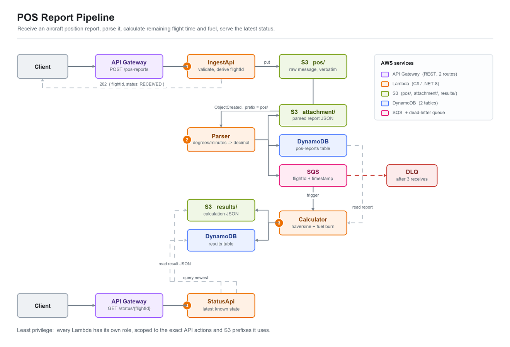

# POS Report Pipeline

An AWS pipeline that ingests aircraft position (POS) reports in ACARS-style
text, parses them, computes the great-circle distance and bearing to the
destination airport, and serves the latest position and recent track per
flight.



```
POST /pos-reports ──► IngestApi ──► S3 (raw/)
                                      │ ObjectCreated
                                      ▼
                                    Parser ──► SQS ──► Calculator ──► DynamoDB
                                      │          │ (DLQ)                 ▲
                                      └► S3 (quarantine/)                │
                                                     GET /status/{id} ─ StatusApi
```

## Project structure

```
pos-report-pipeline/
├── README.md
├── docs/
│   └── architecture.png              # diagram (draw.io / mermaid export)
│
├── cdk/                              # TypeScript CDK app
│   ├── bin/
│   │   └── app.ts                    # CDK entry point
│   ├── lib/
│   │   └── pos-pipeline-stack.ts     # stack definition
│   ├── test/
│   │   └── pos-pipeline-stack.test.ts  # CDK assertions
│   ├── cdk.json
│   ├── package.json
│   └── tsconfig.json
│
└── src/                              # C# Lambda code
    ├── PosReportPipeline.sln
    │
    ├── PosReportPipeline.Shared/     # library shared by all four Lambdas
    │   ├── Models/
    │   │   ├── ParsedPosReport.cs
    │   │   └── CalculationResult.cs
    │   ├── Parsing/
    │   │   └── PosReportParser.cs    # format parse + lat/lon conversion
    │   ├── Geo/
    │   │   ├── Haversine.cs
    │   │   └── AirportCatalog.cs     # hardcoded airport lookup
    │   └── PosReportPipeline.Shared.csproj
    │
    ├── PosReportPipeline.IngestApi/  # Lambda 1: POST /pos-reports
    │   ├── Function.cs
    │   └── PosReportPipeline.IngestApi.csproj
    │
    ├── PosReportPipeline.Parser/     # Lambda 2: S3 event trigger
    │   ├── Function.cs
    │   └── PosReportPipeline.Parser.csproj
    │
    ├── PosReportPipeline.Calculator/ # Lambda 3: SQS trigger
    │   ├── Function.cs
    │   └── PosReportPipeline.Calculator.csproj
    │
    ├── PosReportPipeline.StatusApi/  # Lambda 4: GET /status/{flightId}
    │   ├── Function.cs
    │   └── PosReportPipeline.StatusApi.csproj
    │
    └── PosReportPipeline.Tests/      # xUnit — local unit tests
        ├── PosReportParserTests.cs
        ├── HaversineTests.cs
        ├── FlightIdTests.cs
        └── PosReportPipeline.Tests.csproj
```

`PosReportPipeline.Shared` deliberately has **no AWS dependencies**. All parsing
and geo maths live there, which is why the unit tests need no mocks.

## Report format

```
POS
FLT/ABC123
DT/2026-09-05T14:20:00Z
PSN/N3722.5 W12205.8
ALT/FL350
DEST/KLAX
```

- Line 1 must be `POS`.
- Every other line is `KEY/VALUE`, split on the **first** `/`. Unknown keys are
  ignored, so the format can gain fields without breaking deployed parsers.
- A duplicated key keeps its first occurrence.

| Key | Meaning | Notes |
|---|---|---|
| `FLT` | Callsign | Required. Uppercased. |
| `DT` | Report time | Required. ISO-8601, must be UTC (`Z`). |
| `PSN` | `<lat> <lon>` | Required. DDMM.M — lat has 2 degree digits, lon has 3. |
| `ALT` | Altitude | Required. `FL350` (35000 ft) or `2500FT`. |
| `DEST` | Destination | Required. Four-letter ICAO code. |

`PSN/N3722.5 W12205.8` converts to `37.375, -122.09667` — that is
`37 + 22.5/60` north and `122 + 5.8/60` west. Minutes must be under 60, and the
resulting degrees must be within ±90 / ±180.

### Flight ID

`flightId = {CALLSIGN}-{yyyyMMdd}`, using the UTC date from `DT`. So `ABC123`
reporting at `2026-09-05T14:20:00Z` belongs to flight `ABC123-20260905`.

A flight crossing UTC midnight splits into two flight IDs. This is accepted,
not overlooked: deriving the ID from each report keeps the parser stateless,
and the alternative needs a read-before-write on the hot path.

## API

### `POST /pos-reports`

Body is the raw report as `text/plain`.

```bash
curl -X POST "$API_URL/pos-reports" \
  -H 'Content-Type: text/plain' \
  --data-binary $'POS\nFLT/ABC123\nDT/2026-09-05T14:20:00Z\nPSN/N3722.5 W12205.8\nALT/FL350\nDEST/KLAX'
```

`202 Accepted`:

```json
{
  "status": "accepted",
  "key": "raw/2026/09/05/8f3c1d....txt",
  "receivedAt": "2026-09-05T14:20:31.4021880Z"
}
```

`400` when the body is empty, over 16 KB, or does not start with `POS`.

### `GET /status/{flightId}`

```bash
curl "$API_URL/status/ABC123-20260905?limit=10"
```

`200 OK` returns `flightId`, `reportCount`, `latest`, and `track` in
chronological order. `limit` defaults to 50 and is capped at 500; it selects
the *newest* N reports. `404` when the flight is unknown.

```json
{
  "flightId": "ABC123-20260905",
  "reportCount": 2,
  "latest": {
    "flightId": "ABC123-20260905",
    "reportedAt": "2026-09-05T14:20:00.0000000+00:00",
    "callsign": "ABC123",
    "latitude": 37.375,
    "longitude": -122.096667,
    "altitudeFeet": 35000,
    "destinationIcao": "KLAX",
    "destinationName": "Los Angeles International",
    "distanceToDestinationKm": 506.591,
    "distanceToDestinationNm": 273.537,
    "initialBearingDegrees": 137.785,
    "calculationStatus": "OK"
  },
  "track": ["..."]
}
```

## Error handling

The governing rule is **retry only what can succeed on retry.**

| Failure | Kind | Behaviour |
|---|---|---|
| Empty or malformed body at ingest | Permanent | `400`; nothing written |
| Unparseable report | Permanent | Copied to `quarantine/` with the reason in object metadata; invocation succeeds |
| Unreadable SQS message body | Permanent | Logged and dropped, not re-driven to the DLQ |
| Unknown destination ICAO | Permanent | Stored with null distances and `calculationStatus: UNKNOWN_DESTINATION` |
| DynamoDB throttle, S3 5xx | Transient | Reported as an SQS batch item failure; retried; DLQ after 3 receives |
| Unknown flightId | Not an error | `404` |

An unknown destination still stores the position. The aircraft's location is
real data; a gap in the airport catalog is no reason to discard it.

## Build, test, deploy

Prerequisites: .NET 8 SDK, Node.js 18+, AWS credentials, and a CDK-bootstrapped
account (`npx cdk bootstrap`).

```bash
# Unit tests
cd src && dotnet test PosReportPipeline.sln

# Publish the Lambda bundles — required before any cdk command
cd .. && ./build.sh

# CDK
cd cdk
npm install
npm test          # CDK assertions (runs without the .NET SDK)
npx cdk synth
npx cdk deploy
```

`cdk deploy` prints `ApiUrl`; export it as `$API_URL` for the curl examples
above.

The stack fails fast with a clear message if `src/publish/<Project>` is
missing, rather than deploying an empty bundle that only breaks at invoke time.
The CDK assertion tests set `POS_ALLOW_MISSING_BUNDLES=1` to bypass that check,
since they only read the synthesised template — never set it for a real deploy.

## Design notes

- **Four functions, not one.** Ingest never blocks on parsing; parsing never
  blocks on calculation. A parser bug cannot lose data, because the raw text is
  already durable in S3 and can be replayed.
- **The S3 notification filters on `raw/`.** Without the filter the parser's own
  quarantine copies would re-trigger it in a loop.
- **The status query runs descending.** Ascending with a `Limit` would return
  the *oldest* N reports and label the last of them "latest" — correct for
  short flights, silently wrong for long ones.
- **Not implemented: progress percentage and ETA.** The format carries `DEST`
  but no origin and no ground speed, so both would require inventing data or
  reading previous reports.

## Full design

- Design: `docs/superpowers/specs/2026-09-05-pos-report-pipeline-design.md`
- Implementation plan: `docs/superpowers/plans/2026-09-05-pos-report-pipeline.md`
