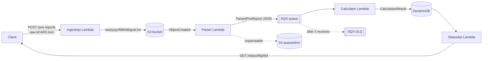

# Architecture

Export this diagram to `docs/architecture.png` (mermaid CLI, draw.io, or the
mermaid live editor) so the README image link resolves.

## Why four functions

Ingest never blocks on parsing, and parsing never blocks on calculation.
A parser bug cannot lose data, because the raw text is already durable in S3
and can be replayed by re-firing the S3 event.
