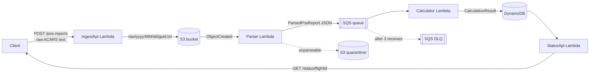

# POS Report Pipeline Implementation Plan

> **For agentic workers:** REQUIRED SUB-SKILL: Use superpowers:subagent-driven-development (recommended) or superpowers:executing-plans to implement this plan task-by-task. Steps use checkbox (`- [ ]`) syntax for tracking.

**Goal:** Build a four-Lambda AWS pipeline that ingests ACARS-style aircraft position reports, parses them, computes great-circle distance and bearing to the destination airport, and serves the latest position and track per flight over HTTP.

**Architecture:** `POST /pos-reports` writes the raw report verbatim to S3. An S3 event drives a parser Lambda that publishes structured reports to SQS. An SQS-triggered calculator Lambda enriches each report with distance/bearing from a hardcoded airport catalog and writes it to DynamoDB. `GET /status/{flightId}` reads it back. All parsing and geo maths live in a shared library with no AWS dependencies, so they are unit-testable with no mocks.

**Tech Stack:** C# / .NET 8 (LTS), AWS Lambda managed `dotnet8` runtime, AWS CDK v2 (TypeScript), xUnit, S3, SQS, DynamoDB, API Gateway REST.

**Spec:** `docs/superpowers/specs/2026-09-05-pos-report-pipeline-design.md`

## Global Constraints

- Target framework: `net8.0`. Lambda runtime: `Runtime.DOTNET_8`.
- `PosReportPipeline.Shared` MUST NOT reference any `AWSSDK.*` or `Amazon.Lambda.*` package. It is pure domain logic. This is what keeps the tests mock-free.
- Earth radius constant: `6371.0088` km (IUGG mean radius). Nautical mile: `1.852` km exactly.
- Flight ID format: `{UPPERCASE_CALLSIGN}-{yyyyMMdd}`, date from the report's `DT` field in UTC.
- DynamoDB keys: PK `flightId` (S), SK `reportedAt` (S, ISO-8601 round-trip `"o"` format).
- `calculationStatus` is one of exactly `OK` or `UNKNOWN_DESTINATION`.
- All timestamps serialised as ISO-8601 UTC with `ToString("o")`.
- Lambda handler string format: `<Assembly>::<Namespace>.Function::Handler`.
- Every Lambda class has a parameterless constructor (used by the runtime) delegating to an injectable constructor (used by tests).

## Environment Note — READ FIRST

`dotnet` is **not installed** on the machine where this plan was written. Every `dotnet` command below is written to be correct but has **not been executed**. The executor must run them and treat first-run failures as expected plan friction, not as bugs in their own work. In particular:

- NuGet package versions in Task 1 are pinned to plausible values. If `dotnet restore` reports a version that does not exist, take the nearest available version for `net8.0` and carry that choice consistently through every project file.
- Run `dotnet restore` once at the end of Task 1 before starting Task 2.

---

### Task 1: Repository scaffolding, solution, and README

**Files:**
- Create: `README.md`
- Create: `.gitignore`
- Create: `docs/architecture.md`
- Create: `src/PosReportPipeline.sln`
- Create: `src/PosReportPipeline.Shared/PosReportPipeline.Shared.csproj`
- Create: `src/PosReportPipeline.Tests/PosReportPipeline.Tests.csproj`

**Interfaces:**
- Consumes: nothing (first task)
- Produces: a restorable solution with `PosReportPipeline.Shared` and `PosReportPipeline.Tests` (test project references shared). Later tasks add four Lambda projects to this same solution.

- [ ] **Step 1: Create the directory tree**

```bash
cd /Users/saiminpyaekyaw/Desktop/aircraft-pos
mkdir -p docs
mkdir -p cdk/bin cdk/lib cdk/test
mkdir -p src/PosReportPipeline.Shared/Models
mkdir -p src/PosReportPipeline.Shared/Parsing
mkdir -p src/PosReportPipeline.Shared/Geo
mkdir -p src/PosReportPipeline.IngestApi
mkdir -p src/PosReportPipeline.Parser
mkdir -p src/PosReportPipeline.Calculator
mkdir -p src/PosReportPipeline.StatusApi
mkdir -p src/PosReportPipeline.Tests
```

- [ ] **Step 2: Write `.gitignore`**

```gitignore
# .NET
bin/
obj/
*.user
src/publish/

# CDK / Node
node_modules/
cdk.out/
cdk/**/*.js
cdk/**/*.d.ts

# OS
.DS_Store
```

- [ ] **Step 3: Write `docs/architecture.md`**

The project structure calls for `docs/architecture.png`. A PNG is a binary export, so this file holds the mermaid **source**; export it to `architecture.png` from any mermaid renderer or draw.io.

````markdown
# Architecture

Export this diagram to `docs/architecture.png` (mermaid CLI, draw.io, or the
mermaid live editor) so the README image link resolves.



## Why four functions

Ingest never blocks on parsing, and parsing never blocks on calculation.
A parser bug cannot lose data, because the raw text is already durable in S3
and can be replayed by re-firing the S3 event.
````

- [ ] **Step 4: Write `README.md`**

````markdown
# POS Report Pipeline

An AWS pipeline that ingests aircraft position (POS) reports in ACARS-style
text, parses them, computes the great-circle distance and bearing to the
destination airport, and serves the latest position and recent track per
flight.


## Project structure

```
pos-report-pipeline/
├── README.md
├── docs/
│   └── architecture.png              # diagram (draw.io / mermaid export)
│
├── cdk/                              # TypeScript CDK app
│   ├── bin/
│   │   └── app.ts                    # CDK entry point
│   ├── lib/
│   │   └── pos-pipeline-stack.ts     # stack definition
│   ├── test/
│   │   └── pos-pipeline-stack.test.ts  # CDK assertions
│   ├── cdk.json
│   ├── package.json
│   └── tsconfig.json
│
└── src/                              # C# Lambda code
    ├── PosReportPipeline.sln
    │
    ├── PosReportPipeline.Shared/     # library shared by all four Lambdas
    │   ├── Models/
    │   │   ├── ParsedPosReport.cs
    │   │   └── CalculationResult.cs
    │   ├── Parsing/
    │   │   └── PosReportParser.cs    # format parse + lat/lon conversion
    │   ├── Geo/
    │   │   ├── Haversine.cs
    │   │   └── AirportCatalog.cs     # hardcoded airport lookup
    │   └── PosReportPipeline.Shared.csproj
    │
    ├── PosReportPipeline.IngestApi/  # Lambda 1: POST /pos-reports
    │   ├── Function.cs
    │   └── PosReportPipeline.IngestApi.csproj
    │
    ├── PosReportPipeline.Parser/     # Lambda 2: S3 event trigger
    │   ├── Function.cs
    │   └── PosReportPipeline.Parser.csproj
    │
    ├── PosReportPipeline.Calculator/ # Lambda 3: SQS trigger
    │   ├── Function.cs
    │   └── PosReportPipeline.Calculator.csproj
    │
    ├── PosReportPipeline.StatusApi/  # Lambda 4: GET /status/{flightId}
    │   ├── Function.cs
    │   └── PosReportPipeline.StatusApi.csproj
    │
    └── PosReportPipeline.Tests/      # xUnit — local unit tests
        ├── PosReportParserTests.cs
        ├── HaversineTests.cs
        ├── FlightIdTests.cs
        └── PosReportPipeline.Tests.csproj
```

`PosReportPipeline.Shared` deliberately has **no AWS dependencies**. All
parsing and geo maths live there, which is why the unit tests need no mocks.

## Status

Under construction — see `docs/superpowers/plans/` for the implementation plan.
````

Sections for the report format, API, build, and deploy are added in Task 12,
once the behaviour they document actually exists.

- [ ] **Step 5: Write `src/PosReportPipeline.Shared/PosReportPipeline.Shared.csproj`**

```xml
<Project Sdk="Microsoft.NET.Sdk">
  <PropertyGroup>
    <TargetFramework>net8.0</TargetFramework>
    <ImplicitUsings>enable</ImplicitUsings>
    <Nullable>enable</Nullable>
    <TreatWarningsAsErrors>true</TreatWarningsAsErrors>
  </PropertyGroup>
</Project>
```

No `PackageReference` entries. That absence is load-bearing — see Global Constraints.

- [ ] **Step 6: Write `src/PosReportPipeline.Tests/PosReportPipeline.Tests.csproj`**

```xml
<Project Sdk="Microsoft.NET.Sdk">
  <PropertyGroup>
    <TargetFramework>net8.0</TargetFramework>
    <ImplicitUsings>enable</ImplicitUsings>
    <Nullable>enable</Nullable>
    <IsPackable>false</IsPackable>
  </PropertyGroup>

  <ItemGroup>
    <PackageReference Include="Microsoft.NET.Test.Sdk" Version="17.11.1" />
    <PackageReference Include="xunit" Version="2.9.2" />
    <PackageReference Include="xunit.runner.visualstudio" Version="2.8.2" />
  </ItemGroup>

  <ItemGroup>
    <ProjectReference Include="../PosReportPipeline.Shared/PosReportPipeline.Shared.csproj" />
  </ItemGroup>
</Project>
```

- [ ] **Step 7: Create the solution and add both projects**

```bash
cd /Users/saiminpyaekyaw/Desktop/aircraft-pos/src
dotnet new sln --name PosReportPipeline --force
dotnet sln PosReportPipeline.sln add \
  PosReportPipeline.Shared/PosReportPipeline.Shared.csproj \
  PosReportPipeline.Tests/PosReportPipeline.Tests.csproj
```

- [ ] **Step 8: Verify the solution restores and builds**

```bash
cd /Users/saiminpyaekyaw/Desktop/aircraft-pos/src
dotnet restore PosReportPipeline.sln
dotnet build PosReportPipeline.sln -c Debug
```

Expected: build succeeds with 0 errors. Two projects with no code yet is fine.
If a package version does not resolve, fix it here and use the same version everywhere.

- [ ] **Step 9: Commit**

```bash
cd /Users/saiminpyaekyaw/Desktop/aircraft-pos
git init 2>/dev/null || true
git add README.md .gitignore docs src
git commit -m "chore: scaffold solution, shared library, and README"
```

---

### Task 2: Haversine distance and bearing

**Files:**
- Create: `src/PosReportPipeline.Shared/Geo/Haversine.cs`
- Test: `src/PosReportPipeline.Tests/HaversineTests.cs`

**Interfaces:**
- Consumes: nothing from earlier tasks
- Produces:
  - `PosReportPipeline.Shared.Geo.Haversine.DistanceKm(double lat1, double lon1, double lat2, double lon2) -> double`
  - `Haversine.InitialBearingDegrees(double lat1, double lon1, double lat2, double lon2) -> double` (normalised to `[0, 360)`)
  - `Haversine.ToNauticalMiles(double km) -> double`
  - `Haversine.EarthRadiusKm` (const `6371.0088`), `Haversine.KmPerNauticalMile` (const `1.852`)

**Why these test cases:** Published city-pair distances vary by several km
between sources depending on the earth model, so asserting against them is a
test that fails for reasons unrelated to your code. The cases below are
**analytically exact** for a sphere — a quarter of a great circle, a half
circle, one degree of latitude — so the expected values are derived, not
looked up. One real-world pair is included at loose tolerance purely as a
sanity check that the units are kilometres and not something else.

- [ ] **Step 1: Write the failing tests**

Create `src/PosReportPipeline.Tests/HaversineTests.cs`:

```csharp
using PosReportPipeline.Shared.Geo;
using Xunit;

namespace PosReportPipeline.Tests;

public class HaversineTests
{
    // Circumference = 2 * PI * 6371.0088 = 40030.2 km
    private const double QuarterCircleKm = 10007.557221; // 2*PI*R/4
    private const double HalfCircleKm = 20015.114442;    // 2*PI*R/2
    private const double OneDegreeKm = 111.195080;       // 2*PI*R/360

    [Fact]
    public void DistanceKm_IdenticalPoints_IsZero()
    {
        Assert.Equal(0d, Haversine.DistanceKm(37.375, -122.0967, 37.375, -122.0967), 6);
    }

    [Fact]
    public void DistanceKm_QuarterWayAroundEquator_IsQuarterCircumference()
    {
        var actual = Haversine.DistanceKm(0, 0, 0, 90);
        Assert.Equal(QuarterCircleKm, actual, 3);
    }

    [Fact]
    public void DistanceKm_EquatorToNorthPole_IsQuarterCircumference()
    {
        var actual = Haversine.DistanceKm(0, 0, 90, 0);
        Assert.Equal(QuarterCircleKm, actual, 3);
    }

    [Fact]
    public void DistanceKm_AntipodalOnEquator_IsHalfCircumference()
    {
        var actual = Haversine.DistanceKm(0, 0, 0, 180);
        Assert.Equal(HalfCircleKm, actual, 3);
    }

    [Fact]
    public void DistanceKm_OneDegreeOfLatitude_IsOneDegreeOfArc()
    {
        Assert.Equal(OneDegreeKm, Haversine.DistanceKm(0, 0, 1, 0), 3);
    }

    [Fact]
    public void DistanceKm_IsSymmetric()
    {
        var forward = Haversine.DistanceKm(33.9425, -118.4081, 40.6413, -73.7781);
        var reverse = Haversine.DistanceKm(40.6413, -73.7781, 33.9425, -118.4081);
        Assert.Equal(forward, reverse, 9);
    }

    [Fact]
    public void DistanceKm_LosAngelesToNewYork_IsAboutThreeThousandNineHundredSeventyKm()
    {
        // Sanity check on units only. 1% tolerance: published values for this
        // pair differ by tens of km depending on the earth model used.
        var actual = Haversine.DistanceKm(33.9425, -118.4081, 40.6413, -73.7781);
        Assert.InRange(actual, 3970 * 0.99, 3970 * 1.01);
    }

    [Theory]
    [InlineData(1, 0, 0)]      // due north
    [InlineData(0, 1, 90)]     // due east
    [InlineData(-1, 0, 180)]   // due south
    [InlineData(0, -1, 270)]   // due west
    public void InitialBearingDegrees_CardinalDirectionsFromOrigin(
        double toLat, double toLon, double expected)
    {
        Assert.Equal(expected, Haversine.InitialBearingDegrees(0, 0, toLat, toLon), 6);
    }

    [Fact]
    public void InitialBearingDegrees_IsNormalisedToZeroToThreeSixty()
    {
        // Heading west-north-west must come back as ~337, never as -23.
        var bearing = Haversine.InitialBearingDegrees(0, 0, 1, -0.4);
        Assert.InRange(bearing, 0, 360);
        Assert.InRange(bearing, 330, 345);
    }

    [Fact]
    public void ToNauticalMiles_UsesExactInternationalNauticalMile()
    {
        Assert.Equal(1d, Haversine.ToNauticalMiles(1.852), 9);
    }
}
```

- [ ] **Step 2: Run tests to verify they fail**

```bash
cd /Users/saiminpyaekyaw/Desktop/aircraft-pos/src
dotnet test PosReportPipeline.Tests/PosReportPipeline.Tests.csproj --filter FullyQualifiedName~HaversineTests
```

Expected: compile error — `The name 'Haversine' does not exist in the current context`.

- [ ] **Step 3: Write the implementation**

Create `src/PosReportPipeline.Shared/Geo/Haversine.cs`:

```csharp
namespace PosReportPipeline.Shared.Geo;

/// <summary>
/// Great-circle distance and bearing on a spherical earth.
/// </summary>
public static class Haversine
{
    /// <summary>IUGG mean earth radius, in kilometres.</summary>
    public const double EarthRadiusKm = 6371.0088;

    /// <summary>The international nautical mile, in kilometres. Exact by definition.</summary>
    public const double KmPerNauticalMile = 1.852;

    /// <summary>Great-circle distance between two points, in kilometres.</summary>
    public static double DistanceKm(double lat1, double lon1, double lat2, double lon2)
    {
        var phi1 = ToRadians(lat1);
        var phi2 = ToRadians(lat2);
        var deltaPhi = ToRadians(lat2 - lat1);
        var deltaLambda = ToRadians(lon2 - lon1);

        var a = Math.Sin(deltaPhi / 2) * Math.Sin(deltaPhi / 2)
              + Math.Cos(phi1) * Math.Cos(phi2)
              * Math.Sin(deltaLambda / 2) * Math.Sin(deltaLambda / 2);

        // Clamp guards against a > 1 from floating-point error at antipodes,
        // which would make Sqrt return NaN.
        var c = 2 * Math.Asin(Math.Sqrt(Math.Clamp(a, 0d, 1d)));

        return EarthRadiusKm * c;
    }

    /// <summary>
    /// Initial great-circle bearing from the first point to the second,
    /// in degrees clockwise from true north, normalised to [0, 360).
    /// </summary>
    public static double InitialBearingDegrees(double lat1, double lon1, double lat2, double lon2)
    {
        var phi1 = ToRadians(lat1);
        var phi2 = ToRadians(lat2);
        var deltaLambda = ToRadians(lon2 - lon1);

        var y = Math.Sin(deltaLambda) * Math.Cos(phi2);
        var x = Math.Cos(phi1) * Math.Sin(phi2)
              - Math.Sin(phi1) * Math.Cos(phi2) * Math.Cos(deltaLambda);

        var bearing = ToDegrees(Math.Atan2(y, x));

        // Atan2 returns (-180, 180]; shift into [0, 360).
        return (bearing + 360) % 360;
    }

    public static double ToNauticalMiles(double kilometres) => kilometres / KmPerNauticalMile;

    private static double ToRadians(double degrees) => degrees * Math.PI / 180d;

    private static double ToDegrees(double radians) => radians * 180d / Math.PI;
}
```

- [ ] **Step 4: Run tests to verify they pass**

```bash
cd /Users/saiminpyaekyaw/Desktop/aircraft-pos/src
dotnet test PosReportPipeline.Tests/PosReportPipeline.Tests.csproj --filter FullyQualifiedName~HaversineTests
```

Expected: all 13 tests PASS.

- [ ] **Step 5: Commit**

```bash
cd /Users/saiminpyaekyaw/Desktop/aircraft-pos
git add src/PosReportPipeline.Shared/Geo/Haversine.cs src/PosReportPipeline.Tests/HaversineTests.cs
git commit -m "feat: add haversine distance and initial bearing"
```

---

### Task 3: Airport catalog

**Files:**
- Create: `src/PosReportPipeline.Shared/Geo/AirportCatalog.cs`
- Test: `src/PosReportPipeline.Tests/AirportCatalogTests.cs`

**Interfaces:**
- Consumes: nothing
- Produces:
  - `PosReportPipeline.Shared.Geo.Airport` — `sealed record Airport(string Icao, string Name, double Latitude, double Longitude)`
  - `AirportCatalog.TryGet(string icao, out Airport? airport) -> bool` (case-insensitive, trims input)
  - `AirportCatalog.All -> IReadOnlyCollection<Airport>`

- [ ] **Step 1: Write the failing tests**

Create `src/PosReportPipeline.Tests/AirportCatalogTests.cs`:

```csharp
using PosReportPipeline.Shared.Geo;
using Xunit;

namespace PosReportPipeline.Tests;

public class AirportCatalogTests
{
    [Fact]
    public void TryGet_KnownCode_ReturnsAirport()
    {
        Assert.True(AirportCatalog.TryGet("KLAX", out var airport));
        Assert.NotNull(airport);
        Assert.Equal("KLAX", airport!.Icao);
        Assert.InRange(airport.Latitude, 33.9, 34.0);
        Assert.InRange(airport.Longitude, -118.5, -118.3);
    }

    [Theory]
    [InlineData("klax")]
    [InlineData("  KLAX  ")]
    [InlineData("Klax")]
    public void TryGet_IsCaseInsensitiveAndTrimsWhitespace(string code)
    {
        Assert.True(AirportCatalog.TryGet(code, out var airport));
        Assert.Equal("KLAX", airport!.Icao);
    }

    [Fact]
    public void TryGet_UnknownCode_ReturnsFalseAndNull()
    {
        Assert.False(AirportCatalog.TryGet("ZZZZ", out var airport));
        Assert.Null(airport);
    }

    [Theory]
    [InlineData(null)]
    [InlineData("")]
    [InlineData("   ")]
    public void TryGet_NullOrBlank_ReturnsFalse(string? code)
    {
        Assert.False(AirportCatalog.TryGet(code!, out var airport));
        Assert.Null(airport);
    }

    [Fact]
    public void All_EntriesHaveValidCoordinatesAndFourLetterCodes()
    {
        Assert.NotEmpty(AirportCatalog.All);
        foreach (var airport in AirportCatalog.All)
        {
            Assert.Equal(4, airport.Icao.Length);
            Assert.Equal(airport.Icao.ToUpperInvariant(), airport.Icao);
            Assert.InRange(airport.Latitude, -90d, 90d);
            Assert.InRange(airport.Longitude, -180d, 180d);
            Assert.False(string.IsNullOrWhiteSpace(airport.Name));
        }
    }
}
```

- [ ] **Step 2: Run tests to verify they fail**

```bash
cd /Users/saiminpyaekyaw/Desktop/aircraft-pos/src
dotnet test PosReportPipeline.Tests/PosReportPipeline.Tests.csproj --filter FullyQualifiedName~AirportCatalogTests
```

Expected: compile error — `AirportCatalog` does not exist.

- [ ] **Step 3: Write the implementation**

Create `src/PosReportPipeline.Shared/Geo/AirportCatalog.cs`:

```csharp
namespace PosReportPipeline.Shared.Geo;

/// <summary>An airport reference point, in decimal degrees.</summary>
public sealed record Airport(string Icao, string Name, double Latitude, double Longitude);

/// <summary>
/// A hardcoded lookup of major international airports.
/// Pure and in-memory by design: it keeps the calculator unit-testable with
/// no I/O. Swapping it for a DynamoDB-backed catalog is a contained change
/// behind <see cref="TryGet"/>.
/// </summary>
public static class AirportCatalog
{
    private static readonly Dictionary<string, Airport> ByIcao =
        new[]
        {
            new Airport("KLAX", "Los Angeles International", 33.9425, -118.4081),
            new Airport("KJFK", "New York John F. Kennedy", 40.6413, -73.7781),
            new Airport("KSFO", "San Francisco International", 37.6213, -122.3790),
            new Airport("KORD", "Chicago O'Hare International", 41.9742, -87.9073),
            new Airport("KATL", "Atlanta Hartsfield-Jackson", 33.6407, -84.4277),
            new Airport("KDFW", "Dallas/Fort Worth International", 32.8998, -97.0403),
            new Airport("KSEA", "Seattle-Tacoma International", 47.4502, -122.3088),
            new Airport("KDEN", "Denver International", 39.8561, -104.6737),
            new Airport("KBOS", "Boston Logan International", 42.3656, -71.0096),
            new Airport("KMIA", "Miami International", 25.7959, -80.2870),
            new Airport("CYYZ", "Toronto Pearson International", 43.6777, -79.6248),
            new Airport("EGLL", "London Heathrow", 51.4700, -0.4543),
            new Airport("EGKK", "London Gatwick", 51.1537, -0.1821),
            new Airport("LFPG", "Paris Charles de Gaulle", 49.0097, 2.5479),
            new Airport("EDDF", "Frankfurt am Main", 50.0379, 8.5622),
            new Airport("EHAM", "Amsterdam Schiphol", 52.3105, 4.7683),
            new Airport("LEMD", "Madrid Barajas", 40.4839, -3.5680),
            new Airport("LIRF", "Rome Fiumicino", 41.8003, 12.2389),
            new Airport("LSZH", "Zurich", 47.4647, 8.5492),
            new Airport("LTFM", "Istanbul", 41.2753, 28.7519),
            new Airport("OMDB", "Dubai International", 25.2532, 55.3657),
            new Airport("OTHH", "Doha Hamad International", 25.2731, 51.6081),
            new Airport("VIDP", "Delhi Indira Gandhi International", 28.5562, 77.1000),
            new Airport("VABB", "Mumbai Chhatrapati Shivaji", 19.0896, 72.8656),
            new Airport("VYYY", "Yangon International", 16.9073, 96.1332),
            new Airport("VTBS", "Bangkok Suvarnabhumi", 13.6900, 100.7501),
            new Airport("WSSS", "Singapore Changi", 1.3644, 103.9915),
            new Airport("VHHH", "Hong Kong International", 22.3080, 113.9185),
            new Airport("ZBAA", "Beijing Capital International", 40.0799, 116.6031),
            new Airport("ZSPD", "Shanghai Pudong International", 31.1443, 121.8083),
            new Airport("RKSI", "Seoul Incheon International", 37.4602, 126.4407),
            new Airport("RJTT", "Tokyo Haneda", 35.5494, 139.7798),
            new Airport("RJAA", "Tokyo Narita", 35.7647, 140.3864),
            new Airport("YSSY", "Sydney Kingsford Smith", -33.9399, 151.1753),
            new Airport("NZAA", "Auckland", -37.0082, 174.7850),
            new Airport("SBGR", "Sao Paulo Guarulhos", -23.4356, -46.4731),
            new Airport("FAOR", "Johannesburg O.R. Tambo", -26.1392, 28.2460),
        }.ToDictionary(a => a.Icao, StringComparer.OrdinalIgnoreCase);

    public static IReadOnlyCollection<Airport> All => ByIcao.Values;

    /// <summary>Looks up an airport by ICAO code. Case-insensitive; trims whitespace.</summary>
    public static bool TryGet(string icao, out Airport? airport)
    {
        airport = null;
        if (string.IsNullOrWhiteSpace(icao))
        {
            return false;
        }

        return ByIcao.TryGetValue(icao.Trim(), out airport);
    }
}
```

- [ ] **Step 4: Run tests to verify they pass**

```bash
cd /Users/saiminpyaekyaw/Desktop/aircraft-pos/src
dotnet test PosReportPipeline.Tests/PosReportPipeline.Tests.csproj --filter FullyQualifiedName~AirportCatalogTests
```

Expected: all tests PASS.

- [ ] **Step 5: Commit**

```bash
cd /Users/saiminpyaekyaw/Desktop/aircraft-pos
git add src/PosReportPipeline.Shared/Geo/AirportCatalog.cs src/PosReportPipeline.Tests/AirportCatalogTests.cs
git commit -m "feat: add hardcoded airport catalog"
```

---

### Task 4: Domain models

**Files:**
- Create: `src/PosReportPipeline.Shared/Models/ParsedPosReport.cs`
- Create: `src/PosReportPipeline.Shared/Models/CalculationResult.cs`

**Interfaces:**
- Consumes: nothing
- Produces: the two record types below. Tasks 5–9 all depend on these exact property names — they become JSON field names on the SQS message and DynamoDB attribute names.

There is no test step here: these are data carriers with no behaviour, and
Tasks 5 and 7 exercise every property. A test asserting that a record stores
what you put in it tests the compiler, not the code.

- [ ] **Step 1: Write `ParsedPosReport.cs`**

```csharp
namespace PosReportPipeline.Shared.Models;

/// <summary>
/// A position report after parsing. This is the SQS message payload between
/// the parser and the calculator, so its property names are wire format.
/// </summary>
public sealed record ParsedPosReport
{
    /// <summary>"{CALLSIGN}-{yyyyMMdd}", e.g. "ABC123-20260905".</summary>
    public required string FlightId { get; init; }

    /// <summary>Uppercased callsign from the FLT field, e.g. "ABC123".</summary>
    public required string Callsign { get; init; }

    /// <summary>Instant of the report. Always UTC.</summary>
    public required DateTimeOffset ReportedAtUtc { get; init; }

    /// <summary>Decimal degrees, north positive. Range [-90, 90].</summary>
    public required double Latitude { get; init; }

    /// <summary>Decimal degrees, east positive. Range [-180, 180].</summary>
    public required double Longitude { get; init; }

    public required int AltitudeFeet { get; init; }

    /// <summary>Uppercased four-letter ICAO code from the DEST field.</summary>
    public required string DestinationIcao { get; init; }

    /// <summary>S3 key the report was read from. Null when parsed outside S3.</summary>
    public string? SourceKey { get; init; }
}
```

- [ ] **Step 2: Write `CalculationResult.cs`**

```csharp
namespace PosReportPipeline.Shared.Models;

/// <summary>Outcome classification for a calculation attempt.</summary>
public static class CalculationStatus
{
    public const string Ok = "OK";

    /// <summary>
    /// The destination ICAO is not in the catalog. A permanent failure:
    /// retrying cannot help, so the report is stored with null distances
    /// rather than discarded. The position itself is still real data.
    /// </summary>
    public const string UnknownDestination = "UNKNOWN_DESTINATION";
}

/// <summary>
/// An enriched position report, as stored in DynamoDB and returned by the
/// status API. Property names are DynamoDB attribute names.
/// </summary>
public sealed record CalculationResult
{
    public required string FlightId { get; init; }
    public required DateTimeOffset ReportedAt { get; init; }
    public required string Callsign { get; init; }
    public required double Latitude { get; init; }
    public required double Longitude { get; init; }
    public required int AltitudeFeet { get; init; }
    public required string DestinationIcao { get; init; }

    /// <summary>Null when the destination is unknown.</summary>
    public string? DestinationName { get; init; }

    /// <summary>Null when the destination is unknown.</summary>
    public double? DistanceToDestinationKm { get; init; }

    /// <summary>Null when the destination is unknown.</summary>
    public double? DistanceToDestinationNm { get; init; }

    /// <summary>Degrees clockwise from true north. Null when the destination is unknown.</summary>
    public double? InitialBearingDegrees { get; init; }

    /// <summary>One of the <see cref="CalculationStatus"/> constants.</summary>
    public required string CalculationStatus { get; init; }

    public required DateTimeOffset CalculatedAt { get; init; }

    public string? SourceKey { get; init; }
}
```

- [ ] **Step 3: Verify it builds**

```bash
cd /Users/saiminpyaekyaw/Desktop/aircraft-pos/src
dotnet build PosReportPipeline.Shared/PosReportPipeline.Shared.csproj -c Debug
```

Expected: build succeeds with 0 errors.

- [ ] **Step 4: Commit**

```bash
cd /Users/saiminpyaekyaw/Desktop/aircraft-pos
git add src/PosReportPipeline.Shared/Models
git commit -m "feat: add ParsedPosReport and CalculationResult models"
```

---

### Task 5: POS report parser and flight ID

**Files:**
- Create: `src/PosReportPipeline.Shared/Parsing/PosReportParser.cs`
- Test: `src/PosReportPipeline.Tests/PosReportParserTests.cs`
- Test: `src/PosReportPipeline.Tests/FlightIdTests.cs`

**Interfaces:**
- Consumes: `ParsedPosReport` (Task 4)
- Produces:
  - `PosReportPipeline.Shared.Parsing.PosReportParseException : Exception`
  - `PosReportParser.Parse(string raw, string? sourceKey = null) -> ParsedPosReport` (throws `PosReportParseException`)
  - `PosReportParser.TryParse(string raw, string? sourceKey, out ParsedPosReport? report, out string? error) -> bool`
  - `PosReportParser.BuildFlightId(string callsign, DateTimeOffset reportedAtUtc) -> string`

**Note on file placement:** `BuildFlightId` lives on `PosReportParser` rather
than in its own file, to match the project structure as specified. `FlightIdTests.cs`
is still its own test file, as specified.

- [ ] **Step 1: Write the failing parser tests**

Create `src/PosReportPipeline.Tests/PosReportParserTests.cs`:

```csharp
using PosReportPipeline.Shared.Parsing;
using Xunit;

namespace PosReportPipeline.Tests;

public class PosReportParserTests
{
    private const string ValidReport = """
        POS
        FLT/ABC123
        DT/2026-09-05T14:20:00Z
        PSN/N3722.5 W12205.8
        ALT/FL350
        DEST/KLAX
        """;

    [Fact]
    public void Parse_ValidReport_ExtractsEveryField()
    {
        var report = PosReportParser.Parse(ValidReport);

        Assert.Equal("ABC123", report.Callsign);
        Assert.Equal("ABC123-20260905", report.FlightId);
        Assert.Equal(new DateTimeOffset(2026, 9, 5, 14, 20, 0, TimeSpan.Zero), report.ReportedAtUtc);
        Assert.Equal(37.375, report.Latitude, 6);
        Assert.Equal(-122.096667, report.Longitude, 6);
        Assert.Equal(35000, report.AltitudeFeet);
        Assert.Equal("KLAX", report.DestinationIcao);
    }

    [Fact]
    public void Parse_PassesThroughSourceKey()
    {
        var report = PosReportParser.Parse(ValidReport, "raw/2026/09/05/abc.txt");
        Assert.Equal("raw/2026/09/05/abc.txt", report.SourceKey);
    }

    // N3722.5 => 37 + 22.5/60 = 37.375
    // S3722.5 => -(37 + 22.5/60)
    // E12205.8 => 122 + 5.8/60 = 122.096667
    // W12205.8 => -(122 + 5.8/60)
    [Theory]
    [InlineData("N3722.5 E12205.8", 37.375, 122.096667)]
    [InlineData("S3722.5 E12205.8", -37.375, 122.096667)]
    [InlineData("N3722.5 W12205.8", 37.375, -122.096667)]
    [InlineData("S3722.5 W12205.8", -37.375, -122.096667)]
    public void Parse_ConvertsAllFourHemispheres(string psn, double expectedLat, double expectedLon)
    {
        var report = PosReportParser.Parse(ReportWith("PSN", psn));
        Assert.Equal(expectedLat, report.Latitude, 6);
        Assert.Equal(expectedLon, report.Longitude, 6);
    }

    [Fact]
    public void Parse_ZeroMinutes_IsWholeDegrees()
    {
        var report = PosReportParser.Parse(ReportWith("PSN", "N0000.0 E00000.0"));
        Assert.Equal(0d, report.Latitude, 6);
        Assert.Equal(0d, report.Longitude, 6);
    }

    [Theory]
    [InlineData("FL350", 35000)]
    [InlineData("FL010", 1000)]
    [InlineData("2500FT", 2500)]
    [InlineData("500FT", 500)]
    public void Parse_AcceptsBothAltitudeForms(string alt, int expectedFeet)
    {
        Assert.Equal(expectedFeet, PosReportParser.Parse(ReportWith("ALT", alt)).AltitudeFeet);
    }

    [Fact]
    public void Parse_IgnoresUnknownKeys()
    {
        var withExtra = ValidReport + "\nSPD/450\nFOB/12.3";
        var report = PosReportParser.Parse(withExtra);
        Assert.Equal("ABC123", report.Callsign);
    }

    [Fact]
    public void Parse_IgnoresBlankLines()
    {
        var withBlanks = ValidReport.Replace("\n", "\n\n");
        Assert.Equal("ABC123", PosReportParser.Parse(withBlanks).Callsign);
    }

    [Fact]
    public void Parse_AcceptsWindowsLineEndings()
    {
        Assert.Equal("ABC123", PosReportParser.Parse(ValidReport.Replace("\n", "\r\n")).Callsign);
    }

    [Theory]
    [InlineData("")]
    [InlineData("   ")]
    [InlineData("NOTPOS\nFLT/ABC123")]
    [InlineData("ACK\nFLT/ABC123")]
    public void Parse_WrongOrMissingHeader_Throws(string raw)
    {
        var ex = Assert.Throws<PosReportParseException>(() => PosReportParser.Parse(raw));
        Assert.Contains("POS", ex.Message, StringComparison.OrdinalIgnoreCase);
    }

    [Fact]
    public void Parse_HeaderIsCaseInsensitiveAndTrimmed()
    {
        Assert.Equal("ABC123", PosReportParser.Parse(ValidReport.Replace("POS", "  pos  ")).Callsign);
    }

    [Theory]
    [InlineData("FLT")]
    [InlineData("DT")]
    [InlineData("PSN")]
    [InlineData("ALT")]
    [InlineData("DEST")]
    public void Parse_MissingRequiredField_ThrowsNamingTheField(string field)
    {
        var raw = string.Join("\n",
            ValidReport.Split('\n').Where(l => !l.StartsWith(field + "/", StringComparison.Ordinal)));

        var ex = Assert.Throws<PosReportParseException>(() => PosReportParser.Parse(raw));
        Assert.Contains(field, ex.Message, StringComparison.Ordinal);
    }

    [Theory]
    [InlineData("N3760.0 W12205.8")]   // latitude minutes >= 60
    [InlineData("N3722.5 W12260.0")]   // longitude minutes >= 60
    [InlineData("N9122.5 W12205.8")]   // latitude degrees out of range
    [InlineData("N3722.5 W18105.8")]   // longitude degrees out of range
    [InlineData("X3722.5 W12205.8")]   // bad hemisphere letter
    [InlineData("N3722.5")]            // longitude missing
    [InlineData("N372 W12205.8")]      // malformed latitude
    [InlineData("nonsense")]
    public void Parse_InvalidPosition_Throws(string psn)
    {
        Assert.Throws<PosReportParseException>(() => PosReportParser.Parse(ReportWith("PSN", psn)));
    }

    [Theory]
    [InlineData("FL")]
    [InlineData("FLABC")]
    [InlineData("350")]
    [InlineData("-100FT")]
    [InlineData("")]
    public void Parse_InvalidAltitude_Throws(string alt)
    {
        Assert.Throws<PosReportParseException>(() => PosReportParser.Parse(ReportWith("ALT", alt)));
    }

    [Theory]
    [InlineData("not-a-date")]
    [InlineData("2026-13-05T14:20:00Z")]
    public void Parse_InvalidTimestamp_Throws(string dt)
    {
        Assert.Throws<PosReportParseException>(() => PosReportParser.Parse(ReportWith("DT", dt)));
    }

    [Fact]
    public void Parse_NonUtcTimestamp_Throws()
    {
        var ex = Assert.Throws<PosReportParseException>(
            () => PosReportParser.Parse(ReportWith("DT", "2026-09-05T14:20:00+07:00")));
        Assert.Contains("UTC", ex.Message, StringComparison.OrdinalIgnoreCase);
    }

    [Theory]
    [InlineData("KLA")]
    [InlineData("KLAXX")]
    [InlineData("KL4X")]
    public void Parse_MalformedDestination_Throws(string dest)
    {
        Assert.Throws<PosReportParseException>(() => PosReportParser.Parse(ReportWith("DEST", dest)));
    }

    [Fact]
    public void Parse_UnknownButWellFormedDestination_Succeeds()
    {
        // Catalog membership is the calculator's problem, not the parser's.
        Assert.Equal("ZZZZ", PosReportParser.Parse(ReportWith("DEST", "ZZZZ")).DestinationIcao);
    }

    [Fact]
    public void Parse_UppercasesCallsignAndDestination()
    {
        var raw = ReportWith("FLT", "abc123").Replace("DEST/KLAX", "DEST/klax");
        var report = PosReportParser.Parse(raw);
        Assert.Equal("ABC123", report.Callsign);
        Assert.Equal("KLAX", report.DestinationIcao);
    }

    [Fact]
    public void TryParse_ValidReport_ReturnsTrueWithNoError()
    {
        Assert.True(PosReportParser.TryParse(ValidReport, null, out var report, out var error));
        Assert.NotNull(report);
        Assert.Null(error);
    }

    [Fact]
    public void TryParse_InvalidReport_ReturnsFalseWithReason()
    {
        Assert.False(PosReportParser.TryParse("garbage", null, out var report, out var error));
        Assert.Null(report);
        Assert.False(string.IsNullOrWhiteSpace(error));
    }

    /// <summary>Returns the valid report with one field's value replaced.</summary>
    private static string ReportWith(string key, string value) =>
        string.Join("\n", ValidReport.Split('\n')
            .Select(line => line.StartsWith(key + "/", StringComparison.Ordinal)
                ? key + "/" + value
                : line));
}
```

- [ ] **Step 2: Write the failing flight ID tests**

Create `src/PosReportPipeline.Tests/FlightIdTests.cs`:

```csharp
using PosReportPipeline.Shared.Parsing;
using Xunit;

namespace PosReportPipeline.Tests;

public class FlightIdTests
{
    [Fact]
    public void BuildFlightId_CombinesCallsignAndUtcDate()
    {
        var at = new DateTimeOffset(2026, 9, 5, 14, 20, 0, TimeSpan.Zero);
        Assert.Equal("ABC123-20260905", PosReportParser.BuildFlightId("ABC123", at));
    }

    [Theory]
    [InlineData("abc123")]
    [InlineData("AbC123")]
    [InlineData("  ABC123  ")]
    public void BuildFlightId_NormalisesCallsignCasingAndWhitespace(string callsign)
    {
        var at = new DateTimeOffset(2026, 9, 5, 14, 20, 0, TimeSpan.Zero);
        Assert.Equal("ABC123-20260905", PosReportParser.BuildFlightId(callsign, at));
    }

    [Fact]
    public void BuildFlightId_UsesUtcDateNotLocalDate()
    {
        // 2026-09-05T23:30-07:00 is 2026-09-06T06:30Z. The UTC date wins.
        var at = new DateTimeOffset(2026, 9, 5, 23, 30, 0, TimeSpan.FromHours(-7));
        Assert.Equal("ABC123-20260906", PosReportParser.BuildFlightId("ABC123", at));
    }

    [Fact]
    public void BuildFlightId_JustBeforeUtcMidnight_UsesThatDay()
    {
        var at = new DateTimeOffset(2026, 9, 5, 23, 59, 59, TimeSpan.Zero);
        Assert.Equal("ABC123-20260905", PosReportParser.BuildFlightId("ABC123", at));
    }

    [Fact]
    public void BuildFlightId_AtUtcMidnight_RollsToTheNextDay()
    {
        // Documents the accepted consequence: a flight crossing UTC midnight
        // splits into two flight IDs. See the design doc, "Flight ID".
        var at = new DateTimeOffset(2026, 9, 6, 0, 0, 0, TimeSpan.Zero);
        Assert.Equal("ABC123-20260906", PosReportParser.BuildFlightId("ABC123", at));
    }

    [Fact]
    public void BuildFlightId_PadsSingleDigitMonthsAndDays()
    {
        var at = new DateTimeOffset(2026, 1, 2, 3, 4, 5, TimeSpan.Zero);
        Assert.Equal("XY9-20260102", PosReportParser.BuildFlightId("XY9", at));
    }

    [Theory]
    [InlineData(null)]
    [InlineData("")]
    [InlineData("   ")]
    public void BuildFlightId_BlankCallsign_Throws(string? callsign)
    {
        Assert.Throws<ArgumentException>(
            () => PosReportParser.BuildFlightId(callsign!, DateTimeOffset.UtcNow));
    }

    [Fact]
    public void BuildFlightId_MatchesTheIdProducedByParse()
    {
        var raw = """
            POS
            FLT/xyz789
            DT/2026-12-31T23:59:00Z
            PSN/S3350.0 E15110.0
            ALT/FL380
            DEST/YSSY
            """;

        var report = PosReportParser.Parse(raw);
        Assert.Equal(PosReportParser.BuildFlightId("XYZ789", report.ReportedAtUtc), report.FlightId);
        Assert.Equal("XYZ789-20261231", report.FlightId);
    }
}
```

- [ ] **Step 3: Run tests to verify they fail**

```bash
cd /Users/saiminpyaekyaw/Desktop/aircraft-pos/src
dotnet test PosReportPipeline.Tests/PosReportPipeline.Tests.csproj \
  --filter "FullyQualifiedName~PosReportParserTests|FullyQualifiedName~FlightIdTests"
```

Expected: compile error — `PosReportParser` does not exist.

- [ ] **Step 4: Write the implementation**

Create `src/PosReportPipeline.Shared/Parsing/PosReportParser.cs`:

```csharp
using System.Globalization;
using System.Text.RegularExpressions;
using PosReportPipeline.Shared.Models;

namespace PosReportPipeline.Shared.Parsing;

/// <summary>
/// Raised when a report cannot be parsed. Always a permanent failure:
/// the same input will never parse, so callers must not retry.
/// </summary>
public sealed class PosReportParseException : Exception
{
    public PosReportParseException(string message) : base(message) { }
}

/// <summary>
/// Parses ACARS-style POS reports. Format:
/// <code>
/// POS
/// FLT/ABC123
/// DT/2026-09-05T14:20:00Z
/// PSN/N3722.5 W12205.8
/// ALT/FL350
/// DEST/KLAX
/// </code>
/// Line one must be POS. Every other line is KEY/VALUE split on the first
/// slash only. Unknown keys are ignored so the format can grow without
/// breaking deployed parsers.
/// </summary>
public static class PosReportParser
{
    private const string Header = "POS";

    // DDMM.M: 2 degree digits for latitude, 3 for longitude, minutes with
    // optional decimals. Hemisphere letter leads.
    private static readonly Regex LatitudePattern =
        new(@"^([NS])(\d{2})(\d{2}(?:\.\d+)?)$", RegexOptions.Compiled | RegexOptions.IgnoreCase);

    private static readonly Regex LongitudePattern =
        new(@"^([EW])(\d{3})(\d{2}(?:\.\d+)?)$", RegexOptions.Compiled | RegexOptions.IgnoreCase);

    private static readonly Regex FlightLevelPattern =
        new(@"^FL(\d{2,3})$", RegexOptions.Compiled | RegexOptions.IgnoreCase);

    private static readonly Regex FeetPattern =
        new(@"^(\d{1,6})FT$", RegexOptions.Compiled | RegexOptions.IgnoreCase);

    private static readonly Regex IcaoPattern =
        new(@"^[A-Z]{4}$", RegexOptions.Compiled);

    /// <summary>Parses a report, or throws <see cref="PosReportParseException"/>.</summary>
    public static ParsedPosReport Parse(string raw, string? sourceKey = null)
    {
        if (string.IsNullOrWhiteSpace(raw))
        {
            throw new PosReportParseException("Report is empty; expected a POS header.");
        }

        var lines = raw
            .Split('\n')
            .Select(line => line.Trim('\r', ' ', '\t'))
            .Where(line => line.Length > 0)
            .ToArray();

        if (lines.Length == 0 || !lines[0].Equals(Header, StringComparison.OrdinalIgnoreCase))
        {
            throw new PosReportParseException(
                $"First line must be '{Header}' but was '{(lines.Length == 0 ? string.Empty : lines[0])}'.");
        }

        var fields = new Dictionary<string, string>(StringComparer.OrdinalIgnoreCase);
        foreach (var line in lines.Skip(1))
        {
            var slash = line.IndexOf('/');
            if (slash <= 0)
            {
                continue; // Not a KEY/VALUE line; ignore rather than fail.
            }

            var key = line[..slash].Trim();
            var value = line[(slash + 1)..].Trim();

            // First occurrence wins, so a duplicated key cannot silently
            // overwrite the value an earlier line already established.
            fields.TryAdd(key, value);
        }

        var callsign = Required(fields, "FLT").ToUpperInvariant();
        var reportedAt = ParseTimestamp(Required(fields, "DT"));
        var (latitude, longitude) = ParsePosition(Required(fields, "PSN"));
        var altitudeFeet = ParseAltitude(Required(fields, "ALT"));
        var destination = ParseDestination(Required(fields, "DEST"));

        return new ParsedPosReport
        {
            FlightId = BuildFlightId(callsign, reportedAt),
            Callsign = callsign,
            ReportedAtUtc = reportedAt,
            Latitude = latitude,
            Longitude = longitude,
            AltitudeFeet = altitudeFeet,
            DestinationIcao = destination,
            SourceKey = sourceKey,
        };
    }

    /// <summary>Non-throwing form of <see cref="Parse"/>.</summary>
    public static bool TryParse(
        string raw, string? sourceKey, out ParsedPosReport? report, out string? error)
    {
        try
        {
            report = Parse(raw, sourceKey);
            error = null;
            return true;
        }
        catch (PosReportParseException ex)
        {
            report = null;
            error = ex.Message;
            return false;
        }
    }

    /// <summary>
    /// Builds the flight ID: uppercased callsign plus the UTC date of the
    /// report. A flight crossing UTC midnight therefore gets two IDs; see
    /// the design doc for why that trade is accepted.
    /// </summary>
    public static string BuildFlightId(string callsign, DateTimeOffset reportedAtUtc)
    {
        if (string.IsNullOrWhiteSpace(callsign))
        {
            throw new ArgumentException("Callsign must not be blank.", nameof(callsign));
        }

        var date = reportedAtUtc.ToUniversalTime().ToString("yyyyMMdd", CultureInfo.InvariantCulture);
        return $"{callsign.Trim().ToUpperInvariant()}-{date}";
    }

    private static string Required(IReadOnlyDictionary<string, string> fields, string key)
    {
        if (!fields.TryGetValue(key, out var value) || string.IsNullOrWhiteSpace(value))
        {
            throw new PosReportParseException($"Required field '{key}' is missing or empty.");
        }

        return value;
    }

    private static DateTimeOffset ParseTimestamp(string value)
    {
        if (!DateTimeOffset.TryParse(
                value,
                CultureInfo.InvariantCulture,
                DateTimeStyles.AssumeUniversal | DateTimeStyles.AdjustToUniversal,
                out var parsed))
        {
            throw new PosReportParseException($"Field 'DT' is not a valid ISO-8601 instant: '{value}'.");
        }

        // AdjustToUniversal converts rather than rejects, so check the raw
        // text: an offset that is not Z means the sender is not reporting UTC
        // and we should not guess on their behalf.
        var trimmed = value.Trim();
        var isUtc = trimmed.EndsWith("Z", StringComparison.OrdinalIgnoreCase)
                 || trimmed.EndsWith("+00:00", StringComparison.Ordinal)
                 || trimmed.EndsWith("-00:00", StringComparison.Ordinal);

        if (!isUtc)
        {
            throw new PosReportParseException(
                $"Field 'DT' must be UTC and end with 'Z' but was '{value}'.");
        }

        return parsed.ToUniversalTime();
    }

    private static (double Latitude, double Longitude) ParsePosition(string value)
    {
        var parts = value.Split(' ', StringSplitOptions.RemoveEmptyEntries | StringSplitOptions.TrimEntries);
        if (parts.Length != 2)
        {
            throw new PosReportParseException(
                $"Field 'PSN' must be '<lat> <lon>' but was '{value}'.");
        }

        var latitude = ParseCoordinate(LatitudePattern, parts[0], 90d, 'S', "latitude");
        var longitude = ParseCoordinate(LongitudePattern, parts[1], 180d, 'W', "longitude");

        return (latitude, longitude);
    }

    /// <summary>Converts one DDMM.M coordinate to signed decimal degrees.</summary>
    private static double ParseCoordinate(
        Regex pattern, string value, double limit, char negativeHemisphere, string label)
    {
        var match = pattern.Match(value);
        if (!match.Success)
        {
            throw new PosReportParseException(
                $"Field 'PSN' has a malformed {label}: '{value}'. Expected DDMM.M form, e.g. N3722.5.");
        }

        var hemisphere = char.ToUpperInvariant(match.Groups[1].Value[0]);
        var degrees = double.Parse(match.Groups[2].Value, CultureInfo.InvariantCulture);
        var minutes = double.Parse(match.Groups[3].Value, CultureInfo.InvariantCulture);

        if (minutes >= 60d)
        {
            throw new PosReportParseException(
                $"Field 'PSN' has {label} minutes of {minutes}, which must be less than 60.");
        }

        var decimalDegrees = degrees + (minutes / 60d);
        if (decimalDegrees > limit)
        {
            throw new PosReportParseException(
                $"Field 'PSN' has {label} {decimalDegrees:F4}, outside the valid range of +/-{limit}.");
        }

        return hemisphere == negativeHemisphere ? -decimalDegrees : decimalDegrees;
    }

    private static int ParseAltitude(string value)
    {
        var flightLevel = FlightLevelPattern.Match(value);
        if (flightLevel.Success)
        {
            return int.Parse(flightLevel.Groups[1].Value, CultureInfo.InvariantCulture) * 100;
        }

        var feet = FeetPattern.Match(value);
        if (feet.Success)
        {
            return int.Parse(feet.Groups[1].Value, CultureInfo.InvariantCulture);
        }

        throw new PosReportParseException(
            $"Field 'ALT' must be a flight level (FL350) or feet (2500FT) but was '{value}'.");
    }

    private static string ParseDestination(string value)
    {
        var destination = value.Trim().ToUpperInvariant();
        if (!IcaoPattern.IsMatch(destination))
        {
            throw new PosReportParseException(
                $"Field 'DEST' must be a four-letter ICAO code but was '{value}'.");
        }

        return destination;
    }
}
```

- [ ] **Step 5: Run tests to verify they pass**

```bash
cd /Users/saiminpyaekyaw/Desktop/aircraft-pos/src
dotnet test PosReportPipeline.Tests/PosReportPipeline.Tests.csproj
```

Expected: every test in all four test classes PASSES.

- [ ] **Step 6: Commit**

```bash
cd /Users/saiminpyaekyaw/Desktop/aircraft-pos
git add src/PosReportPipeline.Shared/Parsing src/PosReportPipeline.Tests
git commit -m "feat: add POS report parser and flight ID derivation"
```

---

### Task 6: IngestApi Lambda — `POST /pos-reports`

**Files:**
- Create: `src/PosReportPipeline.IngestApi/PosReportPipeline.IngestApi.csproj`
- Create: `src/PosReportPipeline.IngestApi/Function.cs`
- Modify: `src/PosReportPipeline.sln` (add the project)

**Interfaces:**
- Consumes: nothing from Shared beyond the header check (parsing happens downstream, by design)
- Produces: handler `PosReportPipeline.IngestApi::PosReportPipeline.IngestApi.Function::Handler`; reads env var `RAW_BUCKET`; writes keys shaped `raw/{yyyy}/{MM}/{dd}/{guid}.txt`

- [ ] **Step 1: Write the project file**

```xml
<Project Sdk="Microsoft.NET.Sdk">
  <PropertyGroup>
    <TargetFramework>net8.0</TargetFramework>
    <ImplicitUsings>enable</ImplicitUsings>
    <Nullable>enable</Nullable>
    <AWSProjectType>Lambda</AWSProjectType>
    <GenerateRuntimeConfigurationFiles>true</GenerateRuntimeConfigurationFiles>
  </PropertyGroup>

  <ItemGroup>
    <PackageReference Include="Amazon.Lambda.Core" Version="2.5.0" />
    <PackageReference Include="Amazon.Lambda.APIGatewayEvents" Version="2.7.1" />
    <PackageReference Include="Amazon.Lambda.Serialization.SystemTextJson" Version="2.4.4" />
    <PackageReference Include="AWSSDK.S3" Version="3.7.415.4" />
  </ItemGroup>

  <ItemGroup>
    <ProjectReference Include="../PosReportPipeline.Shared/PosReportPipeline.Shared.csproj" />
  </ItemGroup>
</Project>
```

- [ ] **Step 2: Write `Function.cs`**

```csharp
using System.Net;
using System.Text;
using System.Text.Json;
using Amazon.Lambda.APIGatewayEvents;
using Amazon.Lambda.Core;
using Amazon.S3;
using Amazon.S3.Model;

[assembly: LambdaSerializer(typeof(Amazon.Lambda.Serialization.SystemTextJson.DefaultLambdaJsonSerializer))]

namespace PosReportPipeline.IngestApi;

/// <summary>
/// Accepts a raw POS report and stores it verbatim in S3.
///
/// This function deliberately does not parse. Ingest stays fast, and a parser
/// bug can never lose data: the raw text is already durable and replayable.
/// </summary>
public class Function
{
    private const int MaxBodyBytes = 16 * 1024;
    private const string Header = "POS";

    private readonly IAmazonS3 _s3;
    private readonly string _bucket;

    /// <summary>Used by the Lambda runtime.</summary>
    public Function()
        : this(new AmazonS3Client(),
               Environment.GetEnvironmentVariable("RAW_BUCKET")
               ?? throw new InvalidOperationException("RAW_BUCKET is not set."))
    {
    }

    /// <summary>Used by tests.</summary>
    public Function(IAmazonS3 s3, string bucket)
    {
        _s3 = s3;
        _bucket = bucket;
    }

    public async Task<APIGatewayProxyResponse> Handler(
        APIGatewayProxyRequest request, ILambdaContext context)
    {
        var body = DecodeBody(request);

        if (string.IsNullOrWhiteSpace(body))
        {
            return Problem(HttpStatusCode.BadRequest, "Request body is empty.");
        }

        if (Encoding.UTF8.GetByteCount(body) > MaxBodyBytes)
        {
            return Problem(HttpStatusCode.BadRequest, $"Report exceeds {MaxBodyBytes} bytes.");
        }

        var firstLine = body.Split('\n')[0].Trim('\r', ' ', '\t');
        if (!firstLine.Equals(Header, StringComparison.OrdinalIgnoreCase))
        {
            // Cheapest possible rejection of obvious garbage. Full validation
            // is the parser's job, downstream.
            return Problem(HttpStatusCode.BadRequest, $"First line must be '{Header}'.");
        }

        var now = DateTimeOffset.UtcNow;
        var key = $"raw/{now:yyyy}/{now:MM}/{now:dd}/{Guid.NewGuid():N}.txt";

        await _s3.PutObjectAsync(new PutObjectRequest
        {
            BucketName = _bucket,
            Key = key,
            ContentBody = body,
            ContentType = "text/plain",
        });

        context.Logger.LogInformation($"Stored report at s3://{_bucket}/{key}");

        return new APIGatewayProxyResponse
        {
            StatusCode = (int)HttpStatusCode.Accepted,
            Headers = new Dictionary<string, string> { ["Content-Type"] = "application/json" },
            Body = JsonSerializer.Serialize(new
            {
                status = "accepted",
                key,
                receivedAt = now.ToString("o"),
            }),
        };
    }

    private static string DecodeBody(APIGatewayProxyRequest request)
    {
        if (request.Body is null)
        {
            return string.Empty;
        }

        return request.IsBase64Encoded
            ? Encoding.UTF8.GetString(Convert.FromBase64String(request.Body))
            : request.Body;
    }

    private static APIGatewayProxyResponse Problem(HttpStatusCode status, string message) =>
        new()
        {
            StatusCode = (int)status,
            Headers = new Dictionary<string, string> { ["Content-Type"] = "application/json" },
            Body = JsonSerializer.Serialize(new { status = "rejected", message }),
        };
}
```

- [ ] **Step 3: Add to the solution and build**

```bash
cd /Users/saiminpyaekyaw/Desktop/aircraft-pos/src
dotnet sln PosReportPipeline.sln add PosReportPipeline.IngestApi/PosReportPipeline.IngestApi.csproj
dotnet build PosReportPipeline.sln -c Debug
```

Expected: build succeeds with 0 errors.

- [ ] **Step 4: Commit**

```bash
cd /Users/saiminpyaekyaw/Desktop/aircraft-pos
git add src/PosReportPipeline.IngestApi src/PosReportPipeline.sln
git commit -m "feat: add ingest API lambda"
```

---

### Task 7: Parser Lambda — S3 trigger

**Files:**
- Create: `src/PosReportPipeline.Parser/PosReportPipeline.Parser.csproj`
- Create: `src/PosReportPipeline.Parser/Function.cs`
- Modify: `src/PosReportPipeline.sln`

**Interfaces:**
- Consumes: `PosReportParser.TryParse` (Task 5), `ParsedPosReport` (Task 4)
- Produces: handler `PosReportPipeline.Parser::PosReportPipeline.Parser.Function::Handler`; env vars `QUEUE_URL`, `QUARANTINE_PREFIX` (default `quarantine/`); SQS message body is `JsonSerializer.Serialize(ParsedPosReport)` with default camelCase-insensitive options

- [ ] **Step 1: Write the project file**

```xml
<Project Sdk="Microsoft.NET.Sdk">
  <PropertyGroup>
    <TargetFramework>net8.0</TargetFramework>
    <ImplicitUsings>enable</ImplicitUsings>
    <Nullable>enable</Nullable>
    <AWSProjectType>Lambda</AWSProjectType>
    <GenerateRuntimeConfigurationFiles>true</GenerateRuntimeConfigurationFiles>
  </PropertyGroup>

  <ItemGroup>
    <PackageReference Include="Amazon.Lambda.Core" Version="2.5.0" />
    <PackageReference Include="Amazon.Lambda.S3Events" Version="3.1.0" />
    <PackageReference Include="Amazon.Lambda.Serialization.SystemTextJson" Version="2.4.4" />
    <PackageReference Include="AWSSDK.S3" Version="3.7.415.4" />
    <PackageReference Include="AWSSDK.SQS" Version="3.7.400.104" />
  </ItemGroup>

  <ItemGroup>
    <ProjectReference Include="../PosReportPipeline.Shared/PosReportPipeline.Shared.csproj" />
  </ItemGroup>
</Project>
```

- [ ] **Step 2: Write `Function.cs`**

```csharp
using System.Net;
using System.Text.Json;
using Amazon.Lambda.Core;
using Amazon.Lambda.S3Events;
using Amazon.S3;
using Amazon.S3.Model;
using Amazon.SQS;
using Amazon.SQS.Model;
using PosReportPipeline.Shared.Parsing;

[assembly: LambdaSerializer(typeof(Amazon.Lambda.Serialization.SystemTextJson.DefaultLambdaJsonSerializer))]

namespace PosReportPipeline.Parser;

/// <summary>
/// Reads raw reports from S3, parses them, and publishes structured reports
/// to SQS.
///
/// A parse failure is permanent, so the object is copied to the quarantine
/// prefix and the invocation returns successfully. Throwing would make Lambda
/// retry a message that can never succeed.
/// </summary>
public class Function
{
    private readonly IAmazonS3 _s3;
    private readonly IAmazonSQS _sqs;
    private readonly string _queueUrl;
    private readonly string _quarantinePrefix;

    public Function()
        : this(new AmazonS3Client(),
               new AmazonSQSClient(),
               Environment.GetEnvironmentVariable("QUEUE_URL")
               ?? throw new InvalidOperationException("QUEUE_URL is not set."),
               Environment.GetEnvironmentVariable("QUARANTINE_PREFIX") ?? "quarantine/")
    {
    }

    public Function(IAmazonS3 s3, IAmazonSQS sqs, string queueUrl, string quarantinePrefix)
    {
        _s3 = s3;
        _sqs = sqs;
        _queueUrl = queueUrl;
        _quarantinePrefix = quarantinePrefix;
    }

    public async Task Handler(S3Event evnt, ILambdaContext context)
    {
        foreach (var record in evnt.Records)
        {
            var bucket = record.S3.Bucket.Name;
            var key = WebUtility.UrlDecode(record.S3.Object.Key);

            await ProcessOne(bucket, key, context);
        }
    }

    private async Task ProcessOne(string bucket, string key, ILambdaContext context)
    {
        string raw;
        using (var response = await _s3.GetObjectAsync(bucket, key))
        using (var reader = new StreamReader(response.ResponseStream))
        {
            raw = await reader.ReadToEndAsync();
        }

        if (!PosReportParser.TryParse(raw, key, out var report, out var error))
        {
            context.Logger.LogError($"Quarantining s3://{bucket}/{key}: {error}");
            await Quarantine(bucket, key, error!);
            return; // Permanent failure. Do not throw; do not retry.
        }

        await _sqs.SendMessageAsync(new SendMessageRequest
        {
            QueueUrl = _queueUrl,
            MessageBody = JsonSerializer.Serialize(report),
        });

        context.Logger.LogInformation($"Parsed {report!.FlightId} from s3://{bucket}/{key}");
    }

    private async Task Quarantine(string bucket, string key, string reason)
    {
        var fileName = key.Split('/').Last();

        await _s3.CopyObjectAsync(new CopyObjectRequest
        {
            SourceBucket = bucket,
            SourceKey = key,
            DestinationBucket = bucket,
            DestinationKey = $"{_quarantinePrefix}{DateTimeOffset.UtcNow:yyyy/MM/dd}/{fileName}",
            MetadataDirective = S3MetadataDirective.REPLACE,
            Metadata =
            {
                // Truncated: S3 caps total user metadata at 2 KB.
                ["parse-error"] = reason.Length > 512 ? reason[..512] : reason,
                ["source-key"] = key,
            },
        });
    }
}
```

- [ ] **Step 3: Add to the solution and build**

```bash
cd /Users/saiminpyaekyaw/Desktop/aircraft-pos/src
dotnet sln PosReportPipeline.sln add PosReportPipeline.Parser/PosReportPipeline.Parser.csproj
dotnet build PosReportPipeline.sln -c Debug
```

Expected: build succeeds with 0 errors.

- [ ] **Step 4: Commit**

```bash
cd /Users/saiminpyaekyaw/Desktop/aircraft-pos
git add src/PosReportPipeline.Parser src/PosReportPipeline.sln
git commit -m "feat: add parser lambda with quarantine on permanent failure"
```

---

### Task 8: Calculator Lambda — SQS trigger

**Files:**
- Create: `src/PosReportPipeline.Calculator/PosReportPipeline.Calculator.csproj`
- Create: `src/PosReportPipeline.Calculator/Function.cs`
- Modify: `src/PosReportPipeline.sln`

**Interfaces:**
- Consumes: `ParsedPosReport`, `CalculationResult`, `CalculationStatus` (Task 4); `Haversine`, `AirportCatalog` (Tasks 2–3)
- Produces: handler `PosReportPipeline.Calculator::PosReportPipeline.Calculator.Function::Handler`; env var `TABLE_NAME`; writes DynamoDB items with PK `flightId`, SK `reportedAt`; returns `SQSBatchResponse`

- [ ] **Step 1: Write the project file**

```xml
<Project Sdk="Microsoft.NET.Sdk">
  <PropertyGroup>
    <TargetFramework>net8.0</TargetFramework>
    <ImplicitUsings>enable</ImplicitUsings>
    <Nullable>enable</Nullable>
    <AWSProjectType>Lambda</AWSProjectType>
    <GenerateRuntimeConfigurationFiles>true</GenerateRuntimeConfigurationFiles>
  </PropertyGroup>

  <ItemGroup>
    <PackageReference Include="Amazon.Lambda.Core" Version="2.5.0" />
    <PackageReference Include="Amazon.Lambda.SQSEvents" Version="2.2.0" />
    <PackageReference Include="Amazon.Lambda.Serialization.SystemTextJson" Version="2.4.4" />
    <PackageReference Include="AWSSDK.DynamoDBv2" Version="3.7.406.7" />
  </ItemGroup>

  <ItemGroup>
    <ProjectReference Include="../PosReportPipeline.Shared/PosReportPipeline.Shared.csproj" />
  </ItemGroup>
</Project>
```

- [ ] **Step 2: Write `Function.cs`**

```csharp
using System.Globalization;
using System.Text.Json;
using Amazon.DynamoDBv2;
using Amazon.DynamoDBv2.Model;
using Amazon.Lambda.Core;
using Amazon.Lambda.SQSEvents;
using PosReportPipeline.Shared.Geo;
using PosReportPipeline.Shared.Models;

[assembly: LambdaSerializer(typeof(Amazon.Lambda.Serialization.SystemTextJson.DefaultLambdaJsonSerializer))]

namespace PosReportPipeline.Calculator;

/// <summary>
/// Enriches parsed reports with distance and bearing to the destination and
/// writes them to DynamoDB.
///
/// Failures are classified before they are handled. A malformed message or an
/// unknown destination cannot succeed on retry, so it is not reported as a
/// batch failure. Only transient faults are, so that SQS retries them and
/// eventually parks them in the DLQ.
/// </summary>
public class Function
{
    private static readonly JsonSerializerOptions JsonOptions =
        new() { PropertyNameCaseInsensitive = true };

    private readonly IAmazonDynamoDB _dynamo;
    private readonly string _tableName;

    public Function()
        : this(new AmazonDynamoDBClient(),
               Environment.GetEnvironmentVariable("TABLE_NAME")
               ?? throw new InvalidOperationException("TABLE_NAME is not set."))
    {
    }

    public Function(IAmazonDynamoDB dynamo, string tableName)
    {
        _dynamo = dynamo;
        _tableName = tableName;
    }

    public async Task<SQSBatchResponse> Handler(SQSEvent evnt, ILambdaContext context)
    {
        var failures = new List<SQSBatchResponse.BatchItemFailure>();

        foreach (var message in evnt.Records)
        {
            try
            {
                await ProcessOne(message, context);
            }
            catch (JsonException ex)
            {
                // Permanent: this message body will never deserialise.
                // Reporting it as a failure would only cycle it to the DLQ.
                context.Logger.LogError($"Discarding unreadable message {message.MessageId}: {ex.Message}");
            }
            catch (Exception ex)
            {
                // Assume transient (throttling, timeouts) and let SQS retry.
                context.Logger.LogError($"Retryable failure on {message.MessageId}: {ex}");
                failures.Add(new SQSBatchResponse.BatchItemFailure { ItemIdentifier = message.MessageId });
            }
        }

        return new SQSBatchResponse { BatchItemFailures = failures };
    }

    private async Task ProcessOne(SQSEvent.SQSMessage message, ILambdaContext context)
    {
        var report = JsonSerializer.Deserialize<ParsedPosReport>(message.Body, JsonOptions)
                     ?? throw new JsonException("Message body deserialised to null.");

        var result = Calculate(report);

        if (result.CalculationStatus == Shared.Models.CalculationStatus.UnknownDestination)
        {
            // Stored anyway: the position is real data, and a gap in the
            // catalog is no reason to lose it.
            context.Logger.LogWarning(
                $"Unknown destination '{report.DestinationIcao}' for {report.FlightId}; storing without distance.");
        }

        await _dynamo.PutItemAsync(new PutItemRequest
        {
            TableName = _tableName,
            Item = ToItem(result),
        });

        context.Logger.LogInformation(
            $"Stored {result.FlightId} at {result.ReportedAt:o} ({result.CalculationStatus}).");
    }

    /// <summary>Pure. No I/O, so it is directly unit-testable.</summary>
    public static CalculationResult Calculate(ParsedPosReport report)
    {
        var common = new CalculationResult
        {
            FlightId = report.FlightId,
            ReportedAt = report.ReportedAtUtc,
            Callsign = report.Callsign,
            Latitude = report.Latitude,
            Longitude = report.Longitude,
            AltitudeFeet = report.AltitudeFeet,
            DestinationIcao = report.DestinationIcao,
            CalculationStatus = Shared.Models.CalculationStatus.UnknownDestination,
            CalculatedAt = DateTimeOffset.UtcNow,
            SourceKey = report.SourceKey,
        };

        if (!AirportCatalog.TryGet(report.DestinationIcao, out var destination))
        {
            return common;
        }

        var distanceKm = Haversine.DistanceKm(
            report.Latitude, report.Longitude, destination!.Latitude, destination.Longitude);

        var bearing = Haversine.InitialBearingDegrees(
            report.Latitude, report.Longitude, destination.Latitude, destination.Longitude);

        return common with
        {
            DestinationName = destination.Name,
            DistanceToDestinationKm = Math.Round(distanceKm, 3),
            DistanceToDestinationNm = Math.Round(Haversine.ToNauticalMiles(distanceKm), 3),
            InitialBearingDegrees = Math.Round(bearing, 3),
            CalculationStatus = Shared.Models.CalculationStatus.Ok,
        };
    }

    private static Dictionary<string, AttributeValue> ToItem(CalculationResult r)
    {
        var item = new Dictionary<string, AttributeValue>
        {
            ["flightId"] = new() { S = r.FlightId },
            ["reportedAt"] = new() { S = r.ReportedAt.ToString("o") },
            ["callsign"] = new() { S = r.Callsign },
            ["latitude"] = Number(r.Latitude),
            ["longitude"] = Number(r.Longitude),
            ["altitudeFeet"] = Number(r.AltitudeFeet),
            ["destinationIcao"] = new() { S = r.DestinationIcao },
            ["calculationStatus"] = new() { S = r.CalculationStatus },
            ["calculatedAt"] = new() { S = r.CalculatedAt.ToString("o") },
        };

        // Nulls are omitted rather than written as NULL attributes, so an
        // unknown-destination item is simply missing its distance fields.
        if (r.DestinationName is not null) item["destinationName"] = new AttributeValue { S = r.DestinationName };
        if (r.SourceKey is not null) item["sourceKey"] = new AttributeValue { S = r.SourceKey };
        if (r.DistanceToDestinationKm is { } km) item["distanceToDestinationKm"] = Number(km);
        if (r.DistanceToDestinationNm is { } nm) item["distanceToDestinationNm"] = Number(nm);
        if (r.InitialBearingDegrees is { } brg) item["initialBearingDegrees"] = Number(brg);

        return item;
    }

    private static AttributeValue Number(double value) =>
        new() { N = value.ToString("R", CultureInfo.InvariantCulture) };
}
```

- [ ] **Step 3: Add to the solution and build**

```bash
cd /Users/saiminpyaekyaw/Desktop/aircraft-pos/src
dotnet sln PosReportPipeline.sln add PosReportPipeline.Calculator/PosReportPipeline.Calculator.csproj
dotnet build PosReportPipeline.sln -c Debug
```

Expected: build succeeds with 0 errors.

- [ ] **Step 4: Add tests for the pure calculation**

`Calculate` is pure, so it is worth testing directly. Add a project reference
first:

```bash
cd /Users/saiminpyaekyaw/Desktop/aircraft-pos/src
dotnet add PosReportPipeline.Tests/PosReportPipeline.Tests.csproj reference \
  PosReportPipeline.Calculator/PosReportPipeline.Calculator.csproj
```

Create `src/PosReportPipeline.Tests/CalculatorTests.cs`:

```csharp
using PosReportPipeline.Shared.Models;
using Xunit;

namespace PosReportPipeline.Tests;

public class CalculatorTests
{
    private static ParsedPosReport ReportTo(string destination) => new()
    {
        FlightId = "ABC123-20260905",
        Callsign = "ABC123",
        ReportedAtUtc = new DateTimeOffset(2026, 9, 5, 14, 20, 0, TimeSpan.Zero),
        Latitude = 37.375,
        Longitude = -122.096667,
        AltitudeFeet = 35000,
        DestinationIcao = destination,
        SourceKey = "raw/2026/09/05/abc.txt",
    };

    [Fact]
    public void Calculate_KnownDestination_PopulatesDistanceAndBearing()
    {
        var result = PosReportPipeline.Calculator.Function.Calculate(ReportTo("KLAX"));

        Assert.Equal(CalculationStatus.Ok, result.CalculationStatus);
        Assert.Equal("Los Angeles International", result.DestinationName);
        Assert.NotNull(result.DistanceToDestinationKm);
        Assert.NotNull(result.DistanceToDestinationNm);
        Assert.NotNull(result.InitialBearingDegrees);

        // Bay Area to LAX is roughly 500 km on a southerly heading.
        Assert.InRange(result.DistanceToDestinationKm!.Value, 450, 600);
        Assert.InRange(result.InitialBearingDegrees!.Value, 120, 180);
    }

    [Fact]
    public void Calculate_NauticalMilesAgreeWithKilometres()
    {
        var result = PosReportPipeline.Calculator.Function.Calculate(ReportTo("KLAX"));
        Assert.Equal(result.DistanceToDestinationKm!.Value / 1.852,
                     result.DistanceToDestinationNm!.Value, 2);
    }

    [Fact]
    public void Calculate_UnknownDestination_StoresPositionWithNullDistances()
    {
        var result = PosReportPipeline.Calculator.Function.Calculate(ReportTo("ZZZZ"));

        Assert.Equal(CalculationStatus.UnknownDestination, result.CalculationStatus);
        Assert.Null(result.DestinationName);
        Assert.Null(result.DistanceToDestinationKm);
        Assert.Null(result.DistanceToDestinationNm);
        Assert.Null(result.InitialBearingDegrees);

        // The position itself must survive.
        Assert.Equal(37.375, result.Latitude, 6);
        Assert.Equal(-122.096667, result.Longitude, 6);
        Assert.Equal("ABC123-20260905", result.FlightId);
        Assert.Equal("ZZZZ", result.DestinationIcao);
    }

    [Fact]
    public void Calculate_CarriesThroughIdentityFields()
    {
        var result = PosReportPipeline.Calculator.Function.Calculate(ReportTo("KLAX"));

        Assert.Equal("ABC123", result.Callsign);
        Assert.Equal(35000, result.AltitudeFeet);
        Assert.Equal("raw/2026/09/05/abc.txt", result.SourceKey);
        Assert.Equal(new DateTimeOffset(2026, 9, 5, 14, 20, 0, TimeSpan.Zero), result.ReportedAt);
    }
}
```

- [ ] **Step 5: Run the full test suite**

```bash
cd /Users/saiminpyaekyaw/Desktop/aircraft-pos/src
dotnet test PosReportPipeline.sln
```

Expected: every test PASSES.

- [ ] **Step 6: Commit**

```bash
cd /Users/saiminpyaekyaw/Desktop/aircraft-pos
git add src/PosReportPipeline.Calculator src/PosReportPipeline.Tests src/PosReportPipeline.sln
git commit -m "feat: add calculator lambda with distance and bearing"
```

---

### Task 9: StatusApi Lambda — `GET /status/{flightId}`

**Files:**
- Create: `src/PosReportPipeline.StatusApi/PosReportPipeline.StatusApi.csproj`
- Create: `src/PosReportPipeline.StatusApi/Function.cs`
- Modify: `src/PosReportPipeline.sln`

**Interfaces:**
- Consumes: the DynamoDB item shape written in Task 8
- Produces: handler `PosReportPipeline.StatusApi::PosReportPipeline.StatusApi.Function::Handler`; env var `TABLE_NAME`; path parameter `flightId`; query parameter `limit` (default 50, cap 500)

- [ ] **Step 1: Write the project file**

```xml
<Project Sdk="Microsoft.NET.Sdk">
  <PropertyGroup>
    <TargetFramework>net8.0</TargetFramework>
    <ImplicitUsings>enable</ImplicitUsings>
    <Nullable>enable</Nullable>
    <AWSProjectType>Lambda</AWSProjectType>
    <GenerateRuntimeConfigurationFiles>true</GenerateRuntimeConfigurationFiles>
  </PropertyGroup>

  <ItemGroup>
    <PackageReference Include="Amazon.Lambda.Core" Version="2.5.0" />
    <PackageReference Include="Amazon.Lambda.APIGatewayEvents" Version="2.7.1" />
    <PackageReference Include="Amazon.Lambda.Serialization.SystemTextJson" Version="2.4.4" />
    <PackageReference Include="AWSSDK.DynamoDBv2" Version="3.7.406.7" />
  </ItemGroup>

  <ItemGroup>
    <ProjectReference Include="../PosReportPipeline.Shared/PosReportPipeline.Shared.csproj" />
  </ItemGroup>
</Project>
```

- [ ] **Step 2: Write `Function.cs`**

```csharp
using System.Globalization;
using System.Net;
using System.Text.Json;
using Amazon.DynamoDBv2;
using Amazon.DynamoDBv2.Model;
using Amazon.Lambda.APIGatewayEvents;
using Amazon.Lambda.Core;

[assembly: LambdaSerializer(typeof(Amazon.Lambda.Serialization.SystemTextJson.DefaultLambdaJsonSerializer))]

namespace PosReportPipeline.StatusApi;

/// <summary>
/// Serves the latest position and recent track for a flight.
///
/// One DynamoDB query answers both: items come back sorted by the reportedAt
/// sort key, so the newest is simply the last one.
/// </summary>
public class Function
{
    private const int DefaultLimit = 50;
    private const int MaxLimit = 500;

    private static readonly JsonSerializerOptions JsonOptions = new()
    {
        PropertyNamingPolicy = JsonNamingPolicy.CamelCase,
        DefaultIgnoreCondition = System.Text.Json.Serialization.JsonIgnoreCondition.WhenWritingNull,
    };

    private readonly IAmazonDynamoDB _dynamo;
    private readonly string _tableName;

    public Function()
        : this(new AmazonDynamoDBClient(),
               Environment.GetEnvironmentVariable("TABLE_NAME")
               ?? throw new InvalidOperationException("TABLE_NAME is not set."))
    {
    }

    public Function(IAmazonDynamoDB dynamo, string tableName)
    {
        _dynamo = dynamo;
        _tableName = tableName;
    }

    public async Task<APIGatewayProxyResponse> Handler(
        APIGatewayProxyRequest request, ILambdaContext context)
    {
        var flightId = request.PathParameters is not null
                       && request.PathParameters.TryGetValue("flightId", out var raw)
            ? raw.Trim().ToUpperInvariant()
            : string.Empty;

        if (string.IsNullOrEmpty(flightId))
        {
            return Json(HttpStatusCode.BadRequest, new { message = "flightId is required." });
        }

        if (!TryReadLimit(request, out var limit, out var limitError))
        {
            return Json(HttpStatusCode.BadRequest, new { message = limitError });
        }

        var response = await _dynamo.QueryAsync(new QueryRequest
        {
            TableName = _tableName,
            KeyConditionExpression = "flightId = :fid",
            ExpressionAttributeValues = new Dictionary<string, AttributeValue>
            {
                [":fid"] = new() { S = flightId },
            },
            // Descending, so Limit keeps the NEWEST reports. Ascending would
            // silently return the oldest `limit` reports and call the last of
            // them "latest", which is wrong for any flight longer than `limit`.
            ScanIndexForward = false,
            Limit = limit,
        });

        if (response.Items is null || response.Items.Count == 0)
        {
            context.Logger.LogInformation($"No reports for {flightId}.");
            return Json(HttpStatusCode.NotFound, new { message = $"No reports found for flight '{flightId}'." });
        }

        // Newest first from DynamoDB; reverse so the track reads chronologically.
        var track = response.Items.Select(ToDto).Reverse().ToList();

        return Json(HttpStatusCode.OK, new
        {
            flightId,
            reportCount = track.Count,
            latest = track[^1],
            track,
        });
    }

    private static bool TryReadLimit(APIGatewayProxyRequest request, out int limit, out string? error)
    {
        limit = DefaultLimit;
        error = null;

        if (request.QueryStringParameters is null
            || !request.QueryStringParameters.TryGetValue("limit", out var raw)
            || string.IsNullOrWhiteSpace(raw))
        {
            return true;
        }

        if (!int.TryParse(raw, NumberStyles.Integer, CultureInfo.InvariantCulture, out var parsed)
            || parsed < 1)
        {
            error = "limit must be a positive integer.";
            return false;
        }

        limit = Math.Min(parsed, MaxLimit);
        return true;
    }

    private static Dictionary<string, object?> ToDto(Dictionary<string, AttributeValue> item)
    {
        var dto = new Dictionary<string, object?>();

        foreach (var (name, value) in item)
        {
            dto[name] = value switch
            {
                { N: not null } => double.Parse(value.N, CultureInfo.InvariantCulture),
                { S: not null } => value.S,
                _ => null,
            };
        }

        return dto;
    }

    private static APIGatewayProxyResponse Json(HttpStatusCode status, object body) =>
        new()
        {
            StatusCode = (int)status,
            Headers = new Dictionary<string, string> { ["Content-Type"] = "application/json" },
            Body = JsonSerializer.Serialize(body, JsonOptions),
        };
}
```

- [ ] **Step 3: Add to the solution and build**

```bash
cd /Users/saiminpyaekyaw/Desktop/aircraft-pos/src
dotnet sln PosReportPipeline.sln add PosReportPipeline.StatusApi/PosReportPipeline.StatusApi.csproj
dotnet build PosReportPipeline.sln -c Debug
dotnet test PosReportPipeline.sln
```

Expected: build succeeds, all tests still PASS.

- [ ] **Step 4: Commit**

```bash
cd /Users/saiminpyaekyaw/Desktop/aircraft-pos
git add src/PosReportPipeline.StatusApi src/PosReportPipeline.sln
git commit -m "feat: add status API lambda"
```

---

### Task 10: Build script and CDK stack

**Files:**
- Create: `build.sh`
- Create: `cdk/package.json`
- Create: `cdk/tsconfig.json`
- Create: `cdk/cdk.json`
- Create: `cdk/bin/app.ts`
- Create: `cdk/lib/pos-pipeline-stack.ts`

**Interfaces:**
- Consumes: the four handler strings from Tasks 6–9; publish output at `src/publish/<ProjectName>`
- Produces: `PosPipelineStack` exported from `cdk/lib/pos-pipeline-stack.ts`, constructed as `new PosPipelineStack(app, id, props)`

- [ ] **Step 1: Write `build.sh`**

```bash
#!/usr/bin/env bash
# Publishes every Lambda project to src/publish/<ProjectName>.
# Run this before `cdk deploy` or `cdk synth` — the stack reads from there.
set -euo pipefail

ROOT="$(cd "$(dirname "${BASH_SOURCE[0]}")" && pwd)"
SRC="$ROOT/src"
OUT="$SRC/publish"

PROJECTS=(
  PosReportPipeline.IngestApi
  PosReportPipeline.Parser
  PosReportPipeline.Calculator
  PosReportPipeline.StatusApi
)

rm -rf "$OUT"

for project in "${PROJECTS[@]}"; do
  echo "==> Publishing $project"
  dotnet publish "$SRC/$project/$project.csproj" \
    --configuration Release \
    --runtime linux-x64 \
    --self-contained false \
    --output "$OUT/$project"
done

echo "==> Published to $OUT"
```

Then:

```bash
chmod +x /Users/saiminpyaekyaw/Desktop/aircraft-pos/build.sh
```

- [ ] **Step 2: Write `cdk/package.json`**

```json
{
  "name": "pos-report-pipeline-cdk",
  "version": "1.0.0",
  "private": true,
  "bin": { "cdk": "bin/app.js" },
  "scripts": {
    "build": "tsc",
    "watch": "tsc -w",
    "test": "jest",
    "cdk": "cdk"
  },
  "devDependencies": {
    "@types/jest": "^29.5.14",
    "@types/node": "^22.10.2",
    "aws-cdk": "^2.173.2",
    "jest": "^29.7.0",
    "ts-jest": "^29.2.5",
    "ts-node": "^10.9.2",
    "typescript": "~5.7.2"
  },
  "dependencies": {
    "aws-cdk-lib": "^2.173.2",
    "constructs": "^10.4.2"
  },
  "jest": {
    "testEnvironment": "node",
    "roots": ["<rootDir>/test"],
    "testMatch": ["**/*.test.ts"],
    "transform": { "^.+\\.tsx?$": "ts-jest" }
  }
}
```

- [ ] **Step 3: Write `cdk/tsconfig.json`**

```json
{
  "compilerOptions": {
    "target": "ES2022",
    "module": "commonjs",
    "lib": ["es2022"],
    "declaration": true,
    "strict": true,
    "noImplicitAny": true,
    "strictNullChecks": true,
    "noImplicitThis": true,
    "alwaysStrict": true,
    "noUnusedLocals": true,
    "noUnusedParameters": true,
    "noImplicitReturns": true,
    "noFallthroughCasesInSwitch": true,
    "inlineSourceMap": true,
    "inlineSources": true,
    "experimentalDecorators": true,
    "strictPropertyInitialization": false,
    "typeRoots": ["./node_modules/@types"]
  },
  "exclude": ["node_modules", "cdk.out"]
}
```

- [ ] **Step 4: Write `cdk/cdk.json`**

```json
{
  "app": "npx ts-node --prefer-ts-exts bin/app.ts",
  "watch": {
    "include": ["**"],
    "exclude": ["README.md", "cdk*.json", "**/*.d.ts", "**/*.js", "tsconfig.json", "package*.json", "node_modules", "test"]
  },
  "context": {
    "@aws-cdk/aws-lambda:recognizeLayerVersion": true,
    "@aws-cdk/core:checkSecretUsage": true,
    "@aws-cdk/aws-iam:minimizePolicies": true,
    "@aws-cdk/core:validateSnapshotRemovalPolicy": true,
    "@aws-cdk/aws-s3:createDefaultLoggingPolicy": true,
    "@aws-cdk/core:target-partitions": ["aws", "aws-cn"]
  }
}
```

- [ ] **Step 5: Write `cdk/lib/pos-pipeline-stack.ts`**

```typescript
import * as path from 'path';
import * as fs from 'fs';
import { Duration, RemovalPolicy, Stack, StackProps, CfnOutput } from 'aws-cdk-lib';
import * as apigw from 'aws-cdk-lib/aws-apigateway';
import * as dynamodb from 'aws-cdk-lib/aws-dynamodb';
import * as lambda from 'aws-cdk-lib/aws-lambda';
import * as eventsources from 'aws-cdk-lib/aws-lambda-event-sources';
import * as logs from 'aws-cdk-lib/aws-logs';
import * as s3 from 'aws-cdk-lib/aws-s3';
import * as s3n from 'aws-cdk-lib/aws-s3-notifications';
import * as sqs from 'aws-cdk-lib/aws-sqs';
import { Construct } from 'constructs';

const PUBLISH_ROOT = path.join(__dirname, '..', '..', 'src', 'publish');

/**
 * Resolves a published Lambda bundle, failing loudly if `build.sh` has not
 * been run. Without this check CDK would deploy an empty asset and the
 * failure would only surface at invoke time, as an opaque runtime error.
 */
function publishedCode(project: string): lambda.Code {
  const dir = path.join(PUBLISH_ROOT, project);
  if (!fs.existsSync(dir)) {
    throw new Error(
      `Missing ${dir}. Run ./build.sh from the repository root before cdk synth or deploy.`,
    );
  }
  return lambda.Code.fromAsset(dir);
}

export class PosPipelineStack extends Stack {
  constructor(scope: Construct, id: string, props?: StackProps) {
    super(scope, id, props);

    // ---- Storage -----------------------------------------------------

    const reportsBucket = new s3.Bucket(this, 'ReportsBucket', {
      blockPublicAccess: s3.BlockPublicAccess.BLOCK_ALL,
      encryption: s3.BucketEncryption.S3_MANAGED,
      enforceSSL: true,
      versioned: true,
      removalPolicy: RemovalPolicy.RETAIN,
    });

    const table = new dynamodb.Table(this, 'PositionsTable', {
      partitionKey: { name: 'flightId', type: dynamodb.AttributeType.STRING },
      sortKey: { name: 'reportedAt', type: dynamodb.AttributeType.STRING },
      billingMode: dynamodb.BillingMode.PAY_PER_REQUEST,
      encryption: dynamodb.TableEncryption.AWS_MANAGED,
      pointInTimeRecovery: true,
      removalPolicy: RemovalPolicy.RETAIN,
    });

    // ---- Messaging ---------------------------------------------------

    const deadLetterQueue = new sqs.Queue(this, 'ParsedReportsDlq', {
      retentionPeriod: Duration.days(14),
      enforceSSL: true,
    });

    const parsedReportsQueue = new sqs.Queue(this, 'ParsedReportsQueue', {
      // Six times the calculator timeout, per the AWS guidance that a queue's
      // visibility timeout must exceed the consumer's timeout.
      visibilityTimeout: Duration.seconds(180),
      retentionPeriod: Duration.days(4),
      enforceSSL: true,
      deadLetterQueue: { queue: deadLetterQueue, maxReceiveCount: 3 },
    });

    // ---- Lambdas -----------------------------------------------------

    const commonProps = {
      runtime: lambda.Runtime.DOTNET_8,
      memorySize: 512,
      timeout: Duration.seconds(30),
      logRetention: logs.RetentionDays.ONE_MONTH,
    };

    const ingestFn = new lambda.Function(this, 'IngestApiFunction', {
      ...commonProps,
      code: publishedCode('PosReportPipeline.IngestApi'),
      handler: 'PosReportPipeline.IngestApi::PosReportPipeline.IngestApi.Function::Handler',
      environment: { RAW_BUCKET: reportsBucket.bucketName },
    });

    const parserFn = new lambda.Function(this, 'ParserFunction', {
      ...commonProps,
      code: publishedCode('PosReportPipeline.Parser'),
      handler: 'PosReportPipeline.Parser::PosReportPipeline.Parser.Function::Handler',
      environment: {
        QUEUE_URL: parsedReportsQueue.queueUrl,
        QUARANTINE_PREFIX: 'quarantine/',
      },
    });

    const calculatorFn = new lambda.Function(this, 'CalculatorFunction', {
      ...commonProps,
      code: publishedCode('PosReportPipeline.Calculator'),
      handler: 'PosReportPipeline.Calculator::PosReportPipeline.Calculator.Function::Handler',
      environment: { TABLE_NAME: table.tableName },
    });

    const statusFn = new lambda.Function(this, 'StatusApiFunction', {
      ...commonProps,
      code: publishedCode('PosReportPipeline.StatusApi'),
      handler: 'PosReportPipeline.StatusApi::PosReportPipeline.StatusApi.Function::Handler',
      environment: { TABLE_NAME: table.tableName },
    });

    // ---- Wiring ------------------------------------------------------

    reportsBucket.grantPut(ingestFn);

    // Only the raw/ prefix triggers the parser. Without the filter, the
    // parser's own quarantine copies would re-trigger it, forever.
    reportsBucket.addEventNotification(
      s3.EventType.OBJECT_CREATED,
      new s3n.LambdaDestination(parserFn),
      { prefix: 'raw/' },
    );

    reportsBucket.grantRead(parserFn, 'raw/*');
    reportsBucket.grantPut(parserFn, 'quarantine/*');
    parsedReportsQueue.grantSendMessages(parserFn);

    calculatorFn.addEventSource(
      new eventsources.SqsEventSource(parsedReportsQueue, {
        batchSize: 10,
        maxBatchingWindow: Duration.seconds(5),
        // Lets one poison message fail without re-driving its nine neighbours.
        reportBatchItemFailures: true,
      }),
    );

    table.grantWriteData(calculatorFn);
    table.grantReadData(statusFn);

    // ---- API ---------------------------------------------------------

    const api = new apigw.RestApi(this, 'PosReportApi', {
      restApiName: 'POS Report Pipeline',
      description: 'Ingest aircraft position reports and query flight status.',
      deployOptions: {
        stageName: 'prod',
        loggingLevel: apigw.MethodLoggingLevel.INFO,
        metricsEnabled: true,
      },
    });

    api.root
      .addResource('pos-reports')
      .addMethod('POST', new apigw.LambdaIntegration(ingestFn));

    api.root
      .addResource('status')
      .addResource('{flightId}')
      .addMethod('GET', new apigw.LambdaIntegration(statusFn));

    // ---- Outputs -----------------------------------------------------

    new CfnOutput(this, 'ApiUrl', { value: api.url });
    new CfnOutput(this, 'ReportsBucketName', { value: reportsBucket.bucketName });
    new CfnOutput(this, 'PositionsTableName', { value: table.tableName });
    new CfnOutput(this, 'ParsedReportsQueueUrl', { value: parsedReportsQueue.queueUrl });
    new CfnOutput(this, 'DeadLetterQueueUrl', { value: deadLetterQueue.queueUrl });
  }
}
```

- [ ] **Step 6: Write `cdk/bin/app.ts`**

```typescript
#!/usr/bin/env node
import 'source-map-support/register';
import * as cdk from 'aws-cdk-lib';
import { PosPipelineStack } from '../lib/pos-pipeline-stack';

const app = new cdk.App();

new PosPipelineStack(app, 'PosReportPipelineStack', {
  // Falls back to the ambient CLI credentials, so `cdk deploy` works with no
  // extra configuration. Set CDK_DEFAULT_* or hardcode for a pinned target.
  env: {
    account: process.env.CDK_DEFAULT_ACCOUNT,
    region: process.env.CDK_DEFAULT_REGION,
  },
  description: 'Aircraft POS report ingest, parse, calculate, and status pipeline.',
});

app.synth();
```

- [ ] **Step 7: Install and synth**

```bash
cd /Users/saiminpyaekyaw/Desktop/aircraft-pos
./build.sh
cd cdk
npm install
npm run build
npx cdk synth
```

Expected: `build.sh` publishes four directories under `src/publish/`, then
`cdk synth` prints a CloudFormation template with no errors.

If `source-map-support` is missing, install it: `npm install --save-dev source-map-support`.

- [ ] **Step 8: Commit**

```bash
cd /Users/saiminpyaekyaw/Desktop/aircraft-pos
git add build.sh cdk/package.json cdk/package-lock.json cdk/tsconfig.json cdk/cdk.json cdk/bin cdk/lib
git commit -m "feat: add CDK stack and build script"
```

---

### Task 11: CDK assertions test

**Files:**
- Create: `cdk/test/pos-pipeline-stack.test.ts`

**Interfaces:**
- Consumes: `PosPipelineStack` (Task 10)
- Produces: nothing consumed downstream

**Prerequisite:** `./build.sh` must have been run, because the stack throws if
the publish directories are missing. That is deliberate — see Task 10, Step 5.

- [ ] **Step 1: Write the test**

```typescript
import * as cdk from 'aws-cdk-lib';
import { Template, Match } from 'aws-cdk-lib/assertions';
import { PosPipelineStack } from '../lib/pos-pipeline-stack';

function synth(): Template {
  const app = new cdk.App();
  const stack = new PosPipelineStack(app, 'TestStack');
  return Template.fromStack(stack);
}

describe('PosPipelineStack', () => {
  const template = synth();

  test('creates exactly four lambda functions on the dotnet8 runtime', () => {
    // The log-retention custom resource adds its own function, so filter by runtime.
    const functions = template.findResources('AWS::Lambda::Function', {
      Properties: { Runtime: 'dotnet8' },
    });
    expect(Object.keys(functions)).toHaveLength(4);
  });

  test('creates the reports bucket with public access blocked and versioning on', () => {
    template.hasResourceProperties('AWS::S3::Bucket', {
      VersioningConfiguration: { Status: 'Enabled' },
      PublicAccessBlockConfiguration: {
        BlockPublicAcls: true,
        BlockPublicPolicy: true,
        IgnorePublicAcls: true,
        RestrictPublicBuckets: true,
      },
    });
  });

  test('creates the positions table keyed by flightId and reportedAt', () => {
    template.hasResourceProperties('AWS::DynamoDB::Table', {
      KeySchema: [
        { AttributeName: 'flightId', KeyType: 'HASH' },
        { AttributeName: 'reportedAt', KeyType: 'RANGE' },
      ],
      BillingMode: 'PAY_PER_REQUEST',
    });
  });

  test('gives the parsed-reports queue a redrive policy of three receives', () => {
    template.hasResourceProperties('AWS::SQS::Queue', {
      RedrivePolicy: Match.objectLike({ maxReceiveCount: 3 }),
    });
  });

  test('creates both the main queue and its dead-letter queue', () => {
    template.resourceCountIs('AWS::SQS::Queue', 2);
  });

  test('triggers the parser only on the raw/ prefix', () => {
    // The notification is configured through a custom resource, so assert on
    // the synthesised filter rule rather than on a native bucket property.
    template.hasResourceProperties('Custom::S3BucketNotifications', {
      NotificationConfiguration: Match.objectLike({
        LambdaFunctionConfigurations: Match.arrayWith([
          Match.objectLike({
            Filter: {
              Key: {
                FilterRules: Match.arrayWith([{ Name: 'prefix', Value: 'raw/' }]),
              },
            },
          }),
        ]),
      }),
    });
  });

  test('subscribes the calculator to the queue with partial batch failures enabled', () => {
    template.hasResourceProperties('AWS::Lambda::EventSourceMapping', {
      BatchSize: 10,
      FunctionResponseTypes: ['ReportBatchItemFailures'],
    });
  });

  test('exposes POST /pos-reports and GET /status/{flightId}', () => {
    template.hasResourceProperties('AWS::ApiGateway::Resource', { PathPart: 'pos-reports' });
    template.hasResourceProperties('AWS::ApiGateway::Resource', { PathPart: 'status' });
    template.hasResourceProperties('AWS::ApiGateway::Resource', { PathPart: '{flightId}' });

    template.hasResourceProperties('AWS::ApiGateway::Method', { HttpMethod: 'POST' });
    template.hasResourceProperties('AWS::ApiGateway::Method', { HttpMethod: 'GET' });
  });

  test('outputs the API url and resource names', () => {
    const outputs = template.findOutputs('*');
    expect(Object.keys(outputs)).toEqual(
      expect.arrayContaining([
        'ApiUrl',
        'ReportsBucketName',
        'PositionsTableName',
        'ParsedReportsQueueUrl',
        'DeadLetterQueueUrl',
      ]),
    );
  });
});
```

- [ ] **Step 2: Run the test**

```bash
cd /Users/saiminpyaekyaw/Desktop/aircraft-pos/cdk
npm test
```

Expected: all tests PASS. If the S3 notification assertion fails, run
`npx cdk synth > /tmp/template.yaml` and read the actual
`Custom::S3BucketNotifications` shape — the property nesting has changed
between CDK versions before.

- [ ] **Step 3: Commit**

```bash
cd /Users/saiminpyaekyaw/Desktop/aircraft-pos
git add cdk/test
git commit -m "test: add CDK assertions for the pipeline stack"
```

---

### Task 12: Complete the README

**Files:**
- Modify: `README.md` (replace the "Status" section written in Task 1)

**Interfaces:**
- Consumes: every behaviour built in Tasks 2–11
- Produces: nothing

- [ ] **Step 1: Replace the `## Status` section with the sections below**

````markdown
## Report format

```
POS
FLT/ABC123
DT/2026-09-05T14:20:00Z
PSN/N3722.5 W12205.8
ALT/FL350
DEST/KLAX
```

- Line 1 must be `POS`.
- Every other line is `KEY/VALUE`, split on the **first** `/`. Unknown keys are
  ignored, so the format can gain fields without breaking deployed parsers.

| Key | Meaning | Notes |
|---|---|---|
| `FLT` | Callsign | Required. Uppercased. |
| `DT` | Report time | Required. ISO-8601, must be UTC (`Z`). |
| `PSN` | `<lat> <lon>` | Required. DDMM.M — lat has 2 degree digits, lon has 3. |
| `ALT` | Altitude | Required. `FL350` (35000 ft) or `2500FT`. |
| `DEST` | Destination | Required. Four-letter ICAO code. |

`PSN/N3722.5 W12205.8` converts to `37.375, -122.09667`:
`37 + 22.5/60` north, `122 + 5.8/60` west.

### Flight ID

`flightId = {CALLSIGN}-{yyyyMMdd}`, using the UTC date from `DT`. So `ABC123`
reporting at `2026-09-05T14:20:00Z` belongs to flight `ABC123-20260905`.

A flight crossing UTC midnight splits into two flight IDs. This is accepted:
deriving the ID from each report keeps the parser stateless, and the
alternative needs a read-before-write on the hot path.

## API

### `POST /pos-reports`

Body is the raw report as `text/plain`.

```bash
curl -X POST "$API_URL/pos-reports" \
  -H 'Content-Type: text/plain' \
  --data-binary $'POS\nFLT/ABC123\nDT/2026-09-05T14:20:00Z\nPSN/N3722.5 W12205.8\nALT/FL350\nDEST/KLAX'
```

`202 Accepted`:

```json
{ "status": "accepted", "key": "raw/2026/09/05/8f3c....txt", "receivedAt": "2026-09-05T14:20:31.4Z" }
```

`400` when the body is empty, over 16 KB, or does not start with `POS`.

### `GET /status/{flightId}`

```bash
curl "$API_URL/status/ABC123-20260905?limit=10"
```

`200 OK` returns `flightId`, `reportCount`, `latest`, and `track` (chronological).
`limit` defaults to 50 and is capped at 500. `404` when the flight is unknown.

## Error handling

The governing rule is **retry only what can succeed on retry.**

| Failure | Kind | Behaviour |
|---|---|---|
| Empty or malformed body at ingest | Permanent | `400`; nothing written |
| Unparseable report | Permanent | Copied to `quarantine/` with the reason in object metadata; invocation succeeds |
| Unknown destination ICAO | Permanent | Stored with null distances and `calculationStatus: UNKNOWN_DESTINATION` |
| DynamoDB throttle, S3 5xx | Transient | Reported as an SQS batch item failure; retried; DLQ after 3 receives |
| Unknown flightId | Not an error | `404` |

An unknown destination still stores the position. The aircraft's location is
real data; a gap in the airport catalog is no reason to discard it.

## Build, test, deploy

Prerequisites: .NET 8 SDK, Node.js 18+, AWS CLI credentials, and a
CDK-bootstrapped account (`npx cdk bootstrap`).

```bash
# Unit tests
cd src && dotnet test PosReportPipeline.sln

# Publish the Lambda bundles — required before any cdk command
cd .. && ./build.sh

# CDK
cd cdk
npm install
npm test          # CDK assertions
npx cdk synth
npx cdk deploy
```

`cdk deploy` prints `ApiUrl`; export it as `$API_URL` for the curl examples above.

The stack fails fast with a clear message if `src/publish/<Project>` is missing,
rather than deploying an empty bundle that only breaks at invoke time.

## Design notes

- **Four functions, not one.** Ingest never blocks on parsing; parsing never
  blocks on calculation. A parser bug cannot lose data, because the raw text is
  already durable in S3 and can be replayed.
- **`PosReportPipeline.Shared` has no AWS dependencies.** All parsing and geo
  maths live there, which is why the unit tests need no mocks.
- **The S3 notification filters on `raw/`.** Without the filter the parser's own
  quarantine copies would re-trigger it in a loop.
- **Not implemented: progress percentage and ETA.** The format carries `DEST`
  but no origin and no ground speed, so both would require inventing data or
  reading previous reports. See `docs/superpowers/specs/` for the reasoning.

## Full design

`docs/superpowers/specs/2026-09-05-pos-report-pipeline-design.md`
````

- [ ] **Step 2: Verify the whole project from a clean state**

```bash
cd /Users/saiminpyaekyaw/Desktop/aircraft-pos
dotnet test src/PosReportPipeline.sln
./build.sh
cd cdk && npm test && npx cdk synth > /dev/null && echo "SYNTH OK"
```

Expected: all .NET tests pass, all CDK tests pass, `SYNTH OK` printed.

- [ ] **Step 3: Commit**

```bash
cd /Users/saiminpyaekyaw/Desktop/aircraft-pos
git add README.md
git commit -m "docs: document format, API, error handling, and deploy"
```

---

## Verification checklist

Before declaring this plan complete, confirm each of the following by running
the command and reading the output — not by assuming:

- [ ] `cd src && dotnet test PosReportPipeline.sln` — all tests pass, 0 failures
- [ ] `./build.sh` — four directories exist under `src/publish/`
- [ ] `cd cdk && npm test` — all assertions pass
- [ ] `cd cdk && npx cdk synth` — template renders with no errors
- [ ] `README.md` renders correctly and the structure tree matches the real tree (`find . -not -path '*/node_modules/*' -not -path '*/obj/*' -not -path '*/bin/*' -not -path '*/.git/*' -type f | sort`)
